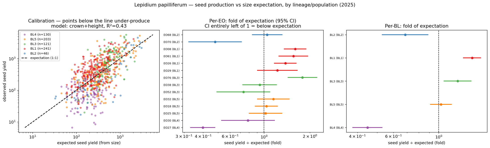
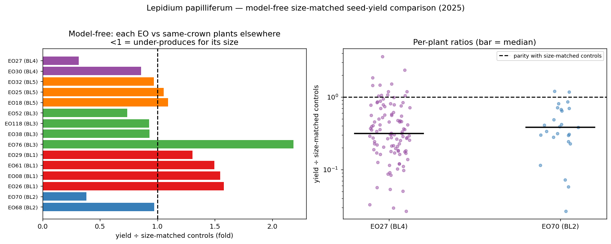
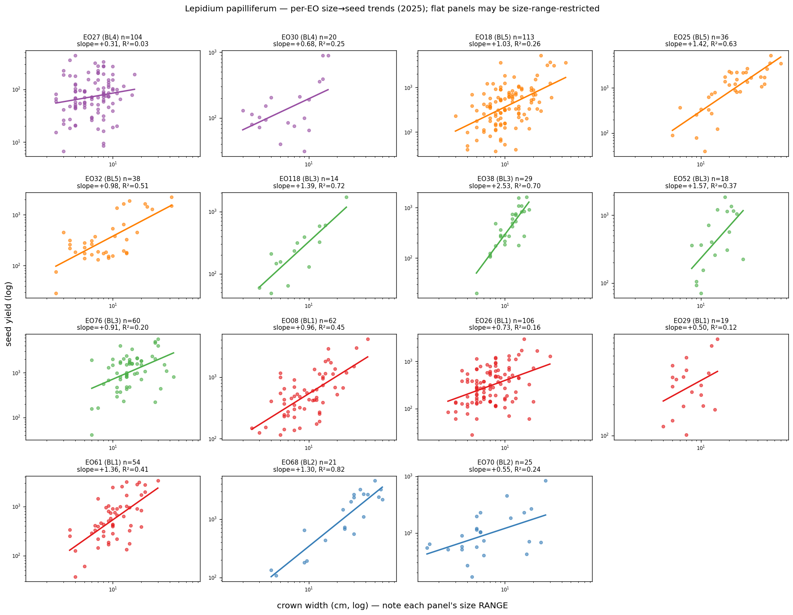
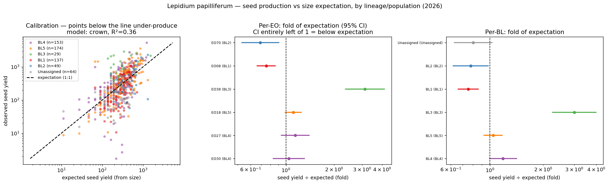
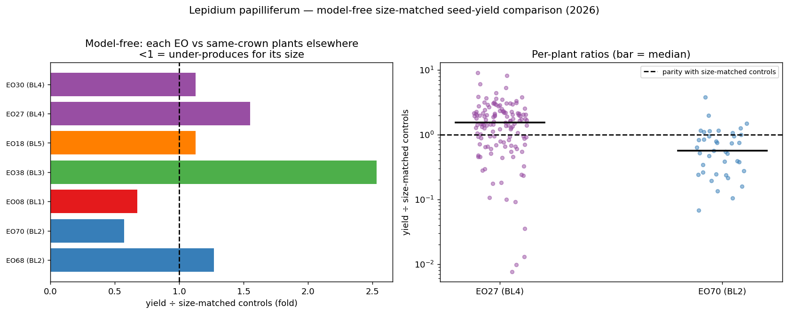
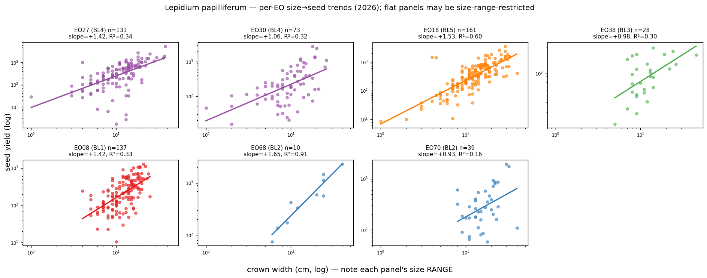
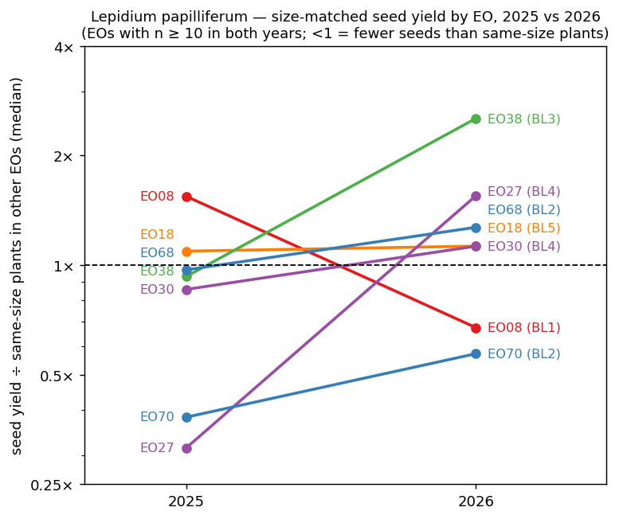

# Plant size and seed production in *Lepidium papilliferum* — approach & results, 2025 and 2026

**Prepared for:** Buerki Lab
**Data:** `LEPA_SQL.db` — **2025:** 741 fruiting plants with size + seed yield; **2026:** 606 plants (seed data still being loaded — see §2)
**Status:** preliminary, observational; two years; mechanism not yet attributed
**Updated:** 2026-10-07 — 2025 re-run on the current seed numbers (n 716 → 741); 2026 added; year-to-year comparison added
**Scripts (reproducible):** `size_seed_model.py`, `size_matched_comparison.py`, `per_eo_trends.py`, `size_seed_years.py` (§10)

---

## Summary

| | 2025 | 2026 |
|---|---|---|
| Plants analysed | 741 (19 EOs) | 606 (12 EOs; seed data incomplete) |
| Best size predictor | crown width (R² 0.43) | crown width (R² 0.36) |
| Expected yield | ≈ 20 · crown^1.25 | ≈ 11 · crown^1.29 |
| EOs **below** what their plant sizes predict (both methods, FDR < 0.05) | **EO27** (0.31×), **EO70** (0.38×) | **EO70** (0.57×), **EO08** (0.67×) |
| EOs above | EO76, EO08, EO26, EO61 | EO38, EO27 |

- **EO70 under-produces in both years.** In 2026 its plants were *larger* than average and still set about half the seed of same-size plants elsewhere — so the shortfall is not a small-plant or bad-year artefact. EO70 is the strongest candidate for mate-limited (self-incompatibility) reproduction.
- **EO27's 2025 shortfall did not repeat.** Its plants were unusually small in 2025; in 2026 they were near-normal size and produced *more* seed than same-size plants elsewhere (1.55×). This supports a poor-year explanation for EO27 in 2025.
- **EO08 flipped** from over-producing (1.55×) in 2025 to under-producing (0.67×) in 2026. One year is not enough to call a population mate-limited.

## 1. Question and rationale

We ask two linked questions:

1. **Does plant size predict seed production**, and what is the best size metric?
2. **Do some individuals / populations produce less seed than their size predicts** — a *reproductive shortfall* — and which ones?

The conservation motivation: if the sporophytic self-incompatibility (SI) system erodes (fewer S-alleles → fewer compatible mates), plants should fail to reach the seed output their size can support. Detecting populations that **under-produce relative to size** flags candidates for SI-limited reproduction. Because field seed-viability runs **>98%**, the seed estimate is effectively a *viable*-seed count, so this analysis targets the **quantity** axis (mate/SI limitation) rather than viability (inbreeding depression), which will be examined separately.

> **Definition — "shortfall".** Throughout, *shortfall* means the amount by which realized seed yield falls **below the yield expected for the plant's size** — a quantity *relative to size*, not absolute low yield. It is measured as the **fold-of-expectation** = observed ÷ expected yield (expected = the species allometric curve at that crown, or the median of same-crown plants elsewhere); **fold < 1 = shortfall** (e.g. 0.4× = a 60% shortfall). A small plant with low absolute yield is *not* a shortfall if that matches its size.

## 2. Data

- **Size** — `Phenotyping.occurrenceCrownSize` (crown width, cm) and `occurrenceHeight` (cm). 2025: read from field rulers / 1-cm tiles in photos (±2–8 cm). 2026: mostly the new measuring boards (each board read on its own scale), field tape and rulers.
- **Seed yield** — `Germplasm.germplasmQuantityEstimate`, a seed count estimated from envelope seed weight (1000-seed-weight equation). Exactly **one accession per plant** (`nAccessions == 1`), so there is no collection-effort confound.
- **Join** — `occurrenceID`, exposed pre-joined by the `vOccurrenceTraits` view. Year = year of `occurrenceDate`; 30 plants from July 2026 whose dates were stored without a year are counted as 2026.
- **Stratification** — Bottleneck Lineage (**BL**, the inferential genetic unit, 5 lineages) ⊃ spatial Group ⊃ Element Occurrence (**EO**, the management unit) ⊃ location. EO→Group→BL key from the sibling `LEPA_EO_spatial_clustering` project (`EO_group_BL_summary.csv`). Convention: BL first; BL order **BL4 ▸ BL5 ▸ BL3 ▸ BL1 ▸ BL2** (habitat area then connectivity); Set1 palette.
- **Each year is analysed on its own.** The expectation is that year's species curve, so a year-wide rise or fall in seed set is absorbed; a population that moves between years moved *relative to the others*.

**Coverage / sampling**

| BL | 2025 n (EOs) | 2026 n (EOs) |
|---|---|---|
| BL4 | 130 — EO27 (104), EO30 (20), EO67 (4), EO72 (2) | 153 — EO27 (131), EO30 (16), EO67 (6) |
| BL5 | 203 — EO18 (113), EO32 (38), EO25 (36), EO48 (9), EO24 (7) | 174 — EO18 (161), EO25 (8), EO24 (5) |
| BL3 | 121 — EO76 (60), EO38 (29), EO52 (18), EO118 (14) | 29 — EO38 (28), EO52 (1) |
| BL1 | 241 — EO26 (106), EO08 (62), EO61 (54), EO29 (19) | 137 — EO08 (137) |
| BL2 | 46 — EO68 (21), EO70 (25) | 49 — EO70 (39), EO68 (10) |
| not yet in the BL key | — | 64 — new 2026 locations EO30-2 (34), EO30-3 (16), EO30-4 (7), EO_NEW2026 (7) |

Sampling caveats: **2026 seed data are incomplete** — seed envelopes from 24 locations are cleaned but not yet imaged and loaded, so BL1 is represented by EO08 alone and BL3 almost entirely by EO38; re-run when loading is complete. **BL4 leans heavily on EO27** in both years; **BL2 has only two EOs**. The 64 plants from new 2026 locations count in the EO-level tests (EO30 has 73 plants in total) but appear as "Unassigned" in the lineage tests until the BL key is extended.

## 3. Approach

A staged, prediction-first design that separates *whether* a shortfall exists from *why*:

1. **Predictor selection (out-of-sample).** Compare candidate allometric models — `height`, `crown`, `ellipse area = (π/4)·crown·height`, and `crown+height` (free exponents) — by **10-fold cross-validated RMSE** on log₁₀(yield), with AIC. Selection is by held-out accuracy, not in-sample R².
2. **Expectation model.** Refit the winner on all plants: the fitted value is the species-wide **expected** log-yield for a plant of that size. The residual (observed − expected) is the per-plant deviation.
3. **Below-expectation detection (two independent methods that must agree):**
   - *Model-based* — per-stratum mean residual (fold-of-expectation) with 95% CI, one-sample test, **Benjamini–Hochberg FDR** across populations; mixed-model (random intercept by EO) shrinkage estimates; an ANCOVA slope-heterogeneity test.
   - *Model-free* — for each plant, the ratio of its yield to the median yield of its **k = 15 nearest neighbours in crown drawn from other EOs** (size-matched controls). No functional form assumed. Per-EO median ratio + Wilcoxon + FDR.
4. **Individual vs population view.** The per-plant ratio is each individual's fitness *given its size*; a population is the **distribution** of these ratios. We report that distribution (not just the median), because reproductive failure is expected to be heterogeneous among individuals.
5. **Per-EO trends + range diagnostic.** Independent within-EO allometric slopes, with an explicit **size-range-restriction** check (a population with a narrow size range cannot reveal a slope).
6. **Year-to-year comparison.** Steps 1–5 are run separately for each year; EOs with ≥10 plants in both years are then compared (§6).

## 4. Results — 2025

### 4.1 Crown width is the best predictor; seed scales allometrically with it

10-fold CV puts **crown** and **crown + height** level (CV-RMSE 0.410 for both); height adds almost nothing (its exponent is 0.10), so crown is kept as the working predictor. Ellipse area (0.418) and height alone (0.449) are worse.

> **seed yield ≈ 20 · crown^1.25**  (R² = 0.43; residual spread ≈ ×/÷ 2.6)

Size is a **real but coarse** predictor — it explains ~43% of yield variance; the remaining ~57% is the biologically interesting part (mate availability, microsite, year, life-history form).

### 4.2 Individual fitness-given-size varies widely — populations are mixtures

Across all 741 plants the per-plant ratio (yield ÷ size-matched peers) has IQR **0.51–1.82×**, and **24% of all plants fall below 0.5×**.

### 4.3 Two populations under-produce for their size — robust and model-free

| population | BL | model fold-of-expectation | **model-free** size-matched fold | verdict |
|---|---|---|---|---|
| **EO27** | BL4 | 0.40× (q = 1e-15) | **0.31×** (q = 7e-15) | **under-produces** |
| **EO70** | BL2 | 0.48× (q = 2e-3) | **0.38×** (q = 5e-6) | **under-produces** |
| EO68 | BL2 | 1.05× | 0.97× | matches (control) |
| others | — | 0.7–1.2× (match) or >1 (over: EO76 1.8×, EO08 1.6×, EO61 1.6×, EO26 1.4×) | same | — |

At the lineage level, **BL4 (0.45×)** and **BL2 (0.69×)** are below expectation; BL5 meets it (1.03×); BL3 (1.24×) and BL1 (1.46×) exceed it. The size→yield slope differs among lineages (ANCOVA interaction F = 8.3, p = 2e-6).

**EO27 and EO70 produce roughly one-third of the seed of equally-sized plants elsewhere**, by same-size comparison alone. The shortfall is a **population-wide down-shift**: 88% (EO27) and 92% (EO70) of individuals fall below parity, 67–68% below 0.5×.

**Why only two EOs are *flagged* (this is conservative).** An EO is flagged only if fold < 1 **and** significant after FDR correction (its 95% CI excludes 1.0). Several EOs sit below 1 but are not significant: EO30 (0.79×) and EO52 (0.73×), plus the thinly-sampled EO67 (n = 4), EO48 (n = 9), EO24 (n = 7), EO72 (n = 2), which rank low (0.6–0.9×) in the mixed-model shrinkage but are too small to test. **"Two flagged" means "two we can statistically confirm," not "only two under-perform."**





### 4.4 Within-population trends, and why EO27's flat slope is *not* evidence of decoupling

Most EOs show a significant positive within-population size→yield slope (e.g. EO38 +2.5, EO25 +1.4, **EO68 +1.3, R² 0.82**). EO27's slope is flat and non-significant (+0.31, R² 0.03), **but EO27 plants were unusually small in 2025** (median crown 7 cm vs 10 cm elsewhere, Mann–Whitney p = 3e-15) over a narrow range, so its slope is range-restricted and uninformative. The small size does **not** affect the *level* result (§4.3), which already conditions on crown.



## 5. Results — 2026

### 5.1 Crown width again the best predictor

Crown (CV-RMSE 0.406) and crown + height (0.407) are level; ellipse area (0.412) and height (0.443) are worse. Crown is selected:

> **seed yield ≈ 11 · crown^1.29**  (R² = 0.36; residual spread ≈ ×/÷ 2.6)

The exponent is almost the same as in 2025, but a plant of a given crown set about half as much seed as in 2025 (intercept 11 vs 20). This may be a real year difference or partly a change in how crowns were measured (boards vs rulers); either way it is absorbed, because each year is compared with its own curve. The per-plant spread is unchanged (IQR **0.52–1.76×**; **24%** of plants below 0.5×).

### 5.2 Populations vs expectation

| population | BL | n | model fold-of-expectation | **model-free** size-matched fold | verdict |
|---|---|---:|---|---|---|
| **EO70** | BL2 | 39 | **0.69×** (q = 0.02) | **0.57×** (q = 8e-5) | **under-produces** |
| **EO08** | BL1 | 137 | **0.75×** (q = 9e-5) | **0.67×** (q = 5e-9) | **under-produces** |
| EO27 | BL4 | 131 | 1.14× (n.s.) | 1.55× (q = 5e-4) | matches / over |
| EO18 | BL5 | 161 | 1.11× (n.s.) | 1.13× (n.s.) | matches |
| EO30 | BL4 | 73 | 1.04× (n.s.) | 1.13× (n.s.) | matches |
| EO68 | BL2 | 10 | — | 1.27× (n.s.) | matches (control) |
| **EO38** | BL3 | 28 | **3.1×** (q = 3e-8) | **2.5×** (q = 1e-6) | **over-produces** |

Lineages: BL1 is below expectation (0.75×, i.e. EO08); BL2 is low (0.78×) but not significant after FDR; BL4 (1.19×) and BL5 (1.04×) match; BL3 is far above (3.0×, i.e. EO38). Unlike 2025, slopes do **not** differ among lineages (ANCOVA F = 0.90, p = 0.48).

At location level, **EO30-3** (a new 2026 location, n = 16) sits at **0.29×** of expectation (q = 6e-6), while the neighbouring EO30-1 (2.0×) and EO30-2 (1.5×) are above it. It is one location in one year, but worth watching. In the mixed model the thinly-sampled EO24 (0.46×, n = 5) and EO_NEW2026 (0.58×, n = 7) rank lowest; both are too small to test.

Within EO70, 74% of plants fall below parity and 41% below 0.5× — a smaller down-shift than in 2025, but still population-wide.





### 5.3 Within-population trends

All seven EOs with ≥10 plants show a significant positive size→yield slope (+0.9 to +1.7). EO27's slope recovered to +1.42 (R² 0.34) now that its plants span a normal size range (median crown 11 cm vs 13 cm elsewhere). This confirms that its flat 2025 slope came from the narrow size range, not from size and seed being decoupled.



## 6. 2025 vs 2026

Seven EOs have ≥10 plants with seed data in both years:

| EO | BL | n 2025 / 2026 | median crown 2025 / 2026 (cm) | size-matched fold 2025 | size-matched fold 2026 | pattern |
|---|---|---|---|---:|---:|---|
| **EO70** | BL2 | 25 / 39 | 6 / 15 | **0.38** | **0.57** | **below in both years** |
| **EO27** | BL4 | 104 / 131 | 7 / 11 | **0.31** | 1.55 | below only in the small-plant year |
| **EO08** | BL1 | 62 / 137 | 10 / 12 | 1.55 | **0.67** | above → below |
| EO38 | BL3 | 29 / 28 | 12 / 11 | 0.93 | 2.53 | match → well above |
| EO18 | BL5 | 113 / 161 | 10 / 13 | 1.09 | 1.13 | matches both years |
| EO30 | BL4 | 20 / 73 | 6 / 10 | 0.86 | 1.13 | matches both years |
| EO68 | BL2 | 21 / 10 | 30 / 16 | 0.97 | 1.27 | matches both years |



Three things stand out:

1. **EO70 is the only population below expectation in both years, and the 2026 result rules out a size explanation.** In 2025 its plants were small (median crown 6 cm); in 2026 they were larger than average (15 cm vs 12 cm elsewhere), yet still set about half the seed of same-size plants. A persistent deficit that does not track plant condition is what mate limitation predicts.
2. **EO27 behaves like a population that had a bad year in 2025.** Its 2025 plants were small *and* set little seed for their size; in 2026, at near-normal size, it out-produced same-size plants elsewhere. That fits the stress-year explanation, and fits its genetic context (BL4 is the S-allele reservoir).
3. **Single-year rankings move a lot.** EO08 went from 1.55× to 0.67× and EO38 from 0.93× to 2.53×. Part of this may come from 2026 seed data being incomplete (each year's controls are drawn from whichever EOs were loaded), but it means a one-year shortfall should be treated as a lead, not a finding. EO08 in 2027 is the test.

## 7. Interpretation: is this self-incompatibility breakdown?

**Established (existence).** EO70 sets far less seed than equally-sized plants elsewhere in two consecutive years, robust to size, curve shape and outliers. EO27 did so in 2025 only; EO08 in 2026 only.

**The pattern is consistent with SI mate limitation for EO70.** Under an eroded S-allele pool, each plant has fewer compatible mates, so seed set falls below what its size could support across the whole population — the population-wide down-shift we see. Two facts point toward *compatible-pollen* limitation specifically:

- **Viability is >98%**, so inbreeding depression is not the quantity driver — seed is not being *set*, rather than being set and then aborting.
- If **pollinator visitation is not limiting** (to be confirmed with field visitation data), pollen is arriving but failing to set seed — the SI signature.

**The *shape* is a testable SI prediction.** SI failure under low diversity is **negative frequency-dependent**: individuals carrying *common* S-alleles have the fewest compatible mates and fail, while *rare*-allele individuals escape. This predicts a population-wide down-shift **with a minority of escapers** — in EO70, 8% of plants met expectation in 2025 and 26% in 2026. If SI is the cause, those escapers should carry the rarer S-alleles / higher mate-compatibility. **Genotyping escapers vs failers within EO70 is the decisive test.**

**EO27 and EO70 have opposite genetic contexts — and two years now separate them.**

| population | lineage | S-allele context (from SRK) | 2025 | 2026 | reading |
|---|---|---|---|---|---|
| **EO70** | BL2 | most bottlenecked — ~8 alleles, near-monomorphic (one allele in ~50/51 individuals) | 0.38× | 0.57× | **persistent; strong SI candidate** |
| **EO27** | BL4 | the species' S-allele **reservoir** (richest lineage) | 0.31× | 1.55× | **2025 poor year**, not a lasting deficit |
| **EO08** | BL1 | BL1 was the strongest over-performing lineage in 2025 | 1.55× | 0.67× | one-year dip; watch |

**A subtlety that strengthens the case.** The "expectation" is the species *average*, which itself includes any SI-limited populations and therefore **understates** the true outcrossed potential. Measured against the consistent over-performers rather than the average, EO70's shortfall is larger still.

**Other live candidates** (affecting interpretation, not the existence of the shortfall): environmental stress / poor year (now the leading explanation for EO27 2025, and possible for EO08 2026), and annual-vs-biennial allocation (an annual-rich population could read as below-expectation through lower seed per canopy).

**Bottom line:** with two years, **EO70** is the one population whose shortfall persists independently of plant size and year — the leading candidate for SI-limited reproduction, now to be *tested* (hand crosses, S-genotypes of escapers vs failers). **EO27's 2025 shortfall looks like a bad year.** The per-individual size-matched ratio remains the right response variable to link to each plant's S-genotype.

## 8. Limitations

Observational, two years; size is an estimate (±2–8 cm) measured differently in 2025 (rulers) and 2026 (mostly boards); yield is weight-derived. **2026 seed data are incomplete** (24 locations not yet loaded), which thins BL1 and BL3 and changes the pool of size-matched controls between years. Some strata are thinly sampled (BL4 ≈ EO27; BL2 = 2 EOs); the expectation includes the candidate populations (a conservative choice); new 2026 locations are not yet in the BL key. None of these explain away EO70's two-year shortfall, but they bound interpretation of the one-year changes.

## 9. Next steps

1. **Re-run 2026 when seed loading is complete**, and extend the BL key to the new 2026 locations (EO30-2/-3/-4, EO_NEW2026).
2. **SRK intersection** — join per-EO **and per-individual** S-allele richness / mate-compatibility (`P_compat`) to the shortfall; test whether EO70 escapers carry compatible genotypes.
3. **Experimental confirmation** — supplemental **hand-cross pollination** (via the SRK cross design) in EO70: if compatible outcross pollen rescues seed set, the limitation is pollen-compatibility (SI), not resources or pollinators; pair with **field pollinator-visitation data**.
4. **EO08 and EO30-3** — check in 2027 whether the 2026 dips persist.
5. **Viability** — `germplasmQuantityUnviable` to separate quantity-shortfall (SI/mate limitation) from inbreeding depression.
6. **Form** — test the crown:height aspect ratio (2026 boards record both) for bimodality (annual vs biennial) and add it as a covariate.

## 10. Reproducibility

| script | what it does | outputs (`_<year>` suffix when `--year` is given) |
|---|---|---|
| `size_seed_model.py` | predictor selection (CV) + expectation model + below-expectation detection (model-based, FDR, mixed model) + sampling-n | `size_seed_model_strata_<year>.tsv`, `size_seed_model_<year>.png` |
| `size_matched_comparison.py` | model-free same-size comparison (k-NN matched controls) | `size_matched_comparison_<year>.tsv`, `size_matched_comparison_<year>.png` |
| `per_eo_trends.py` | independent per-EO allometric slopes + size-range diagnostic | `per_eo_trends_<year>.tsv`, `per_eo_trends_<year>.png` |
| `size_seed_years.py` | 2025 vs 2026 comparison (run after the other scripts for both years) | `size_seed_years.tsv`, `size_seed_years.png` |

All read `LEPA_SQL.db` via `vOccurrenceTraits` and the `EO_group_BL_summary.csv` BL key. From the lab's `SQL_DB/` folder:

```bash
for y in 2025 2026; do
  python Queries/size_seed_model.py --year $y
  python Queries/size_matched_comparison.py --year $y
  python Queries/per_eo_trends.py --year $y
done
python Queries/size_seed_years.py
```

`--year all` (the default) pools both years. Requires pandas, numpy, scipy, statsmodels, scikit-learn and matplotlib (the lab's Anaconda Python has them). Elsewhere, point the scripts at the database and BL key with `--db` and `--bl-key`.
