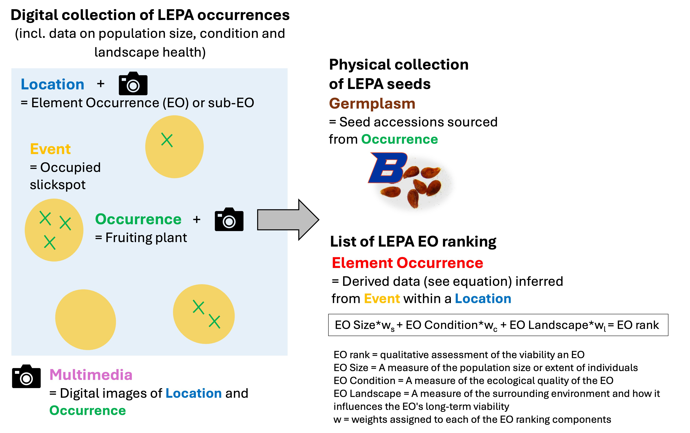
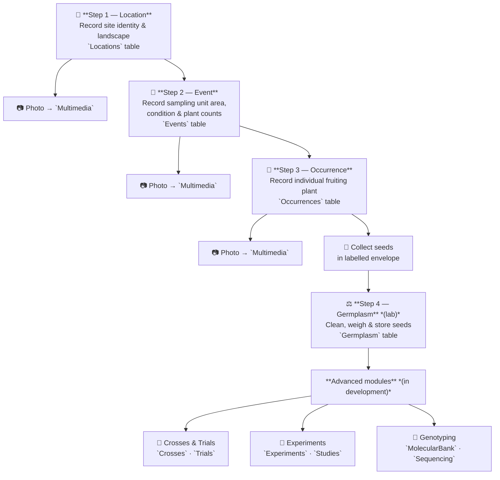

# Genetic Rescue of Threatened Plants

**Database Documentation**

---

## Table of Contents

- [Introduction](#introduction)
- [Aim](#aim)
- [Problem](#problem)
- [Solution](#solution)
- [Approach](#approach)
  - [Genetic Rescue Process](#genetic-rescue-process)
  - [Propagation vs. Breeding](#propagation-vs-breeding)
- [Documentation](#documentation)
  - [Data Life Cycle](#data-life-cycle)
  - [Data Structure](#data-structure)
    - [Admin](#module-admin)
    - [Environment](#module-environment)
    - [Demography](#module-demography)
    - [Biobanking](#module-biobanking)
    - [Genetics](#module-genetics)
    - [Breeding](#module-breeding)
  - [Additional Information on Occurrences](#additional-information-on-occurrences)
  - [Additional Information on Germplasm](#additional-information-on-germplasm)
  - [Terminology and Ontology](#terminology-and-ontology)
  - [Publications](#publications)
  - [Data Acquisition Workflow](#data-acquisition-workflow)
    - [Step 1 — Location](#step-1--location-locations)
    - [Step 2 — Event](#step-2--event-events)
    - [Step 3 — Occurrence](#step-3--occurrence-occurrences)
    - [Step 4 — Germplasm (Lab)](#step-4--germplasm-germplasm--lab)
    - [Advanced Modules](#advanced-modules-in-development)
  - [SQL Database](#sql-database)

---

## Introduction

This document provides documentation on the database framework and workflow applied to support genetic rescue programs for threatened plant species.

---

## Aim

The overarching ***aim*** of this framework is to develop a **transferable approach for the genetic rescue of threatened plant species**, using a relational database to track individual plants from field collection through biobanking, breeding trials, and restoration.

---

## Problem

Threatened species are often caught in an **extinction vortex**, where small population sizes and genetic erosion reduce their adaptability to environmental and anthropogenic threats. This process accelerates population declines, leading to local extirpations and, ultimately, species extinction.

---

## Solution

> Implement **informed breeding** strategies to restore **functionally viable** and **genetically diverse** soil seed banks, thereby enhancing population resilience and long-term sustainability.

We are implementing our solution within a **relational database** to support its deployment and scalability across threatened plant taxa. This document provides documentation on the **technological approach** and **database structure**.

---

## Approach

### Genetic Rescue Process

The following steps outline the **research and development activities required to conduct a successful genetic rescue**. These steps have been co-designed with federal conservation partners.

1. **Determine population genetic diversity** and **define seed zones** for translocation.
   *Assess genetic variation across populations to identify suitable sources and guide translocation planning.*
2. **Conduct fieldwork** and **develop seed biobanking protocols**.
   *Collect representative samples and establish standardized methods for seed handling, storage, and documentation.*
3. **Characterize seed behavior** and **germination requirements**.
   *Evaluate dormancy types, environmental cues, and physiological traits influencing germination success.*
4. **Conduct seed bulking** for propagation.
   *Increase the quantity of genetically diverse seeds under controlled conditions for research and restoration use.*
5. **Implement informed breeding** to restore genetic diversity and seed dormancy.
   *Use controlled crosses and genetic data to enhance adaptive traits and maintain population variability.*
6. **Carry out seed reintroductions** to restore and sustain populations.
   *Reestablish self-sustaining populations in suitable habitats using genetically and ecologically informed strategies.*

### Propagation vs. Breeding

**Propagation**

| Aspect              | Description                                                                                                                  |
| ------------------- | ---------------------------------------------------------------------------------------------------------------------------- |
| **Goal**            | To *increase the number* of individuals — often from existing genetic material — for restoration, research, or conservation. |
| **Genetic focus**   | **Maintain** or **represent** existing genetic diversity; no intentional genetic modification or selection.                  |
| **Typical methods** | Germinating seeds, vegetative cuttings, tissue culture, or nursery cultivation.                                              |
| **Outcome**         | More plants (or seeds) for translocation, reintroduction, or experimentation.                                                |
| **Example**         | Growing hundreds of individuals from collected wild seeds to reestablish a population in the field.                          |

**Breeding**

| Aspect              | Description                                                                                                                     |
| ------------------- | ------------------------------------------------------------------------------------------------------------------------------- |
| **Goal**            | To **modify or enhance** genetic traits (e.g., fecundity, dormancy, disease resistance) through controlled mating or selection. |
| **Genetic focus**   | **Change** or **optimize** genetic composition intentionally.                                                                   |
| **Typical methods** | Controlled cross-pollination, hybridization, or selection of desired phenotypes/genotypes.                                      |
| **Outcome**         | New or improved genotypes for restoration, agriculture, or resilience.                                                          |
| **Example**         | Crossing individuals from different populations to restore seed dormancy or increase adaptive potential.                        |

<div align="right"><a href="#table-of-contents">↑ Table of Contents</a></div>

---

## Documentation

This section provides documentation on the data life cycle and workflow applied in this framework, as well as details on the data structure (i.e., names and descriptions of SQL tables).

### Data Life Cycle

To achieve our aim, we have developed a data flow subdivided into seven modules (Figure 1) that, when integrated, will support informed breeding programs generating seeds for ecological restoration of threatened plants. The data flow is designed to reverse the species extinction vortex by increasing:

- Population adaptability;
- Individual survival and reproduction;
- Population growth.


### Data Structure

The database is organised into **seven modules**. The `TableModules` table maps each SQL table to its module; the `Terms` table provides field-level definitions and ontology references for documented tables.

| Module          | Tables                                                                                                          |
| --------------- | --------------------------------------------------------------------------------------------------------------- |
| **Admin**       | `Persons`, `Projects`, `Studies`, `Experiments`, `Notes`, `Protocols`, `Multimedia`, `Trials`, `Terms`, `TableModules` |
| **Environment** | `EOs`, `Taxonomy`, `Locations`, `EORankings`                                                                   |
| **Demography**  | `Events`, `EODemography`, `Phenotyping`                                                                         |
| **Biobanking**  | `Occurrences`, `Germplasm`, `SeedLots`, `MolecularBank`, `TissueBank`, `PedigreeNodes`, `GermplasmTransactions` |
| **Genetics**    | `Sequencing`                                                                                                    |
| **Breeding**    | `Crosses`                                                                                                       |
| **Restoration** | `GerminationPlates`, `Germinations`                                                                             |

> All 28 tables are registered in `TableModules`. The database also defines 2 SQL views — `vOccurrenceTraits` (occurrence + phenotyping + summed germplasm yield) and `GermplasmIDs_EO27`.

---

#### Module: Admin

##### `Persons`

Stores metadata on personnel involved in the genetic rescue process.

*Term definitions not yet documented in the `Terms` table. Fields derived from the SQL schema.*

| Field          | Type    | Standard | Notes / FK |
| -------------- | ------- | -------- | ---------- |
| `personID`     | INTEGER | —        | —          |
| `lastName`     | TEXT    | —        | —          |
| `firstName`    | TEXT    | —        | —          |
| `middleName`   | TEXT    | —        | —          |
| `institution`  | TEXT    | —        | —          |
| `emailAddress` | TEXT    | —        | —          |
| `phoneNumber`  | NUMERIC | —        | —          |

##### `Projects`

Stores metadata on funded grants underpinning each step of the genetic rescue process.

*Term definitions not yet documented in the `Terms` table. Fields derived from the SQL schema.*

| Field                | Type    | Standard | Notes / FK           |
| -------------------- | ------- | -------- | -------------------- |
| `projectID`          | INTEGER | —        | —                    |
| `projectName`        | TEXT    | —        | —                    |
| `projectRemarks`     | TEXT    | —        | —                    |
| `fundingInformation` | TEXT    | —        | —                    |
| `objectives`         | TEXT    | —        | —                    |
| `piNameID`           | INTEGER | —        | → `Persons.personID` |
| `copiNameID`         | INTEGER | —        | → `Persons.personID` |
| `hiredPersonnelID`   | INTEGER | —        | → `Persons.personID` |
| `otherPersonnelID`   | INTEGER | —        | —                    |
| `partner`            | TEXT    | —        | —                    |
| `startDate`          | TEXT    | —        | —                    |
| `endDate`            | TEXT    | —        | —                    |
| `externalReferences` | TEXT    | —        | —                    |
| `deliverable`        | TEXT    | —        | —                    |

##### `Studies`

Stores metadata on studies (e.g., grant objectives or dissertation chapters) supporting the projects.

*Term definitions not yet documented in the `Terms` table. Fields derived from the SQL schema.*

| Field                | Type    | Standard | Notes / FK               |
| -------------------- | ------- | -------- | ------------------------ |
| `studyID`            | NUMERIC | —        | —                        |
| `studyCodes`         | TEXT    | —        | —                        |
| `studyDescription`   | TEXT    | —        | —                        |
| `studyObjective`     | TEXT    | —        | —                        |
| `studyHypothesis`    | TEXT    | —        | —                        |
| `studyPrediction`    | TEXT    | —        | —                        |
| `studyType`          | TEXT    | —        | —                        |
| `active`             | TEXT    | —        | —                        |
| `projectID`          | INTEGER | —        | → `Projects.projectID`   |
| `taxonID`            | INTEGER | —        | → `Taxonomy.taxonID`     |
| `germplasmIDs`       | TEXT    | —        | —                        |
| `locationID`         | INTEGER | —        | → `Locations.locationID` |
| `personID`           | INTEGER | —        | → `Persons.personID`     |
| `studiesStartDate`   | TEXT    | —        | —                        |
| `studiesEndDate`     | TEXT    | —        | —                        |
| `externalReferences` | TEXT    | —        | —                        |
| `studyRemarks`       | TEXT    | —        | —                        |

##### `Experiments`

Stores metadata on experiments associated with the studies. These are scientific experiments based on hypotheses. Results of experiments will be tested in trials (see `Trials`).

*Term definitions not yet documented in the `Terms` table. Fields derived from the SQL schema.*

| Field                     | Type    | Standard | Notes / FK                |
| ------------------------- | ------- | -------- | ------------------------- |
| `experimentID`            | INTEGER | —        | —                         |
| `studyID`                 | INTEGER | —        | → `Studies.studyID`       |
| `experimentalDesign`      | TEXT    | —        | —                         |
| `experimentDuration`      | INTEGER | —        | —                         |
| `experimentDurationUnit`  | TEXT    | —        | —                         |
| `startDate`               | TEXT    | —        | —                         |
| `endDate`                 | TEXT    | —        | —                         |
| `environmentalParameters` | TEXT    | —        | —                         |
| `treatmentDescription`    | TEXT    | —        | —                         |
| `personID`                | INTEGER | —        | → `Persons.personID`      |
| `growthFacility`          | TEXT    | —        | —                         |
| `observationVariables`    | TEXT    | —        | —                         |
| `observationLevel`        | TEXT    | —        | —                         |
| `germplasmID`             | INTEGER | —        | → `Germplasm.germplasmID` |
| `locationID`              | INTEGER | —        | → `Locations.locationID`  |
| `remarks`                 | TEXT    | —        | —                         |
| `protocolID`              | NUMERIC | —        | → `Protocols.protocolID`  |

##### `Notes`

Stores remarks on the data such as missing unique IDs (sometimes referred to as barcodes) or lat/long.

*Term definitions not yet documented in the `Terms` table. Fields derived from the SQL schema.*

| Field        | Type    | Standard | Notes / FK           |
| ------------ | ------- | -------- | -------------------- |
| `noteID`     | INTEGER | —        | —                    |
| `noteType`   | TEXT    | —        | —                    |
| `noteRemark` | TEXT    | —        | —                    |
| `noteDate`   | TEXT    | —        | —                    |
| `personID`   | INTEGER | —        | → `Persons.personID` |

##### `Protocols`

Stores metadata on the protocols used to conduct the experiments.

*Term definitions not yet documented in the `Terms` table. Fields derived from the SQL schema.*

| Field            | Type    | Standard | Notes / FK                   |
| ---------------- | ------- | -------- | ---------------------------- |
| `protocolID`     | INTEGER | —        | —                            |
| `protocolTitle`  | TEXT    | —        | —                            |
| `protocolGoal`   | TEXT    | —        | —                            |
| `prtocolVersion` | TEXT    | —        | —                            |
| `multimediaID`   | INTEGER | —        | → `Multimedia.multimediaID`  |
| `personID`       | INTEGER | —        | → `Persons.personID`         |
| `experimentID`   | INTEGER | —        | → `Experiments.experimentID` |
| `submissionDate` | TEXT    | —        | —                            |
| `studyID`        | INTEGER | —        | → `Studies.studyID`          |

##### `Multimedia`

Stores metadata on digital media (primarily JPEG images) associated with each `locationID` (see `Locations` in **Environment**) and `occurrenceID` (see `Occurrences` in **Biobanking**), providing visual documentation for each site and plant.

| Field               | Type    | Standard                                                               | Definition                                                                                                                      |
| ------------------- | ------- | ---------------------------------------------------------------------- | ------------------------------------------------------------------------------------------------------------------------------- |
| `multimediaID`      | Integer | —                                                                      | The unique integer referring to the multimedia (e.g., image). multimediaID exists for Locations and Occurrences                 |
| `identifier`        | Text    | [Audubon Core](http://rs.tdwg.org/ac/doc/termlist/#dcterms_identifier) | The name of the multimedia (image) as outputted by the device (e.g., camera)                                                    |
| `type`              | Text    | [Audubon Core](http://rs.tdwg.org/ac/doc/termlist/#dc_type)            | Tell us what type of multimedia (image) is captured.  For us: field plant image,  greenhouse plant image,  field location image |
| `format`            | Text    | [Audubon Core](http://rs.tdwg.org/ac/doc/termlist/#dc_format)          | "tiff", "jpeg"                                                                                                                  |
| `createDate`        | Text    | [Audubon Core](http://rs.tdwg.org/ac/doc/termlist/#xmp_CreateDate)     | Date when the multimedia (image) was recorded in MM-DD-YYYY                                                                     |
| `title`             | Text    | [Audubon Core](http://rs.tdwg.org/ac/doc/termlist/#dcterms_title)      | Provide a short description of the taxon and what is imaged (e.g., Target species: Habitus in the field)                        |
| `license`           | Text    | —                                                                      | —                                                                                                                               |
| `rightsHolder`      | Text    | [Dublin Core](http://purl.org/dc/terms/license)                        | The type of license associated with the multimedia (image)                                                                      |
| `multimediaStorage` | Text    | [Dublin Core](http://purl.org/dc/terms/rightsHolder)                   | The person name or organization managing the multimedia (image)                                                                 |

##### `Trials`

Stores metadata on breeding trials to produce seeds for restoration. These trials are based on scientific evidence (stored in `Experiments`).

*Term definitions not yet documented in the `Terms` table. Fields derived from the SQL schema.*

| Field              | Type    | Standard | Notes / FK               |
| ------------------ | ------- | -------- | ------------------------ |
| `trialID`          | INTEGER | —        | —                        |
| `trialName`        | TEXT    | —        | —                        |
| `trialDescription` | TEXT    | —        | —                        |
| `active`           | TEXT    | —        | —                        |
| `taxonID`          | INTEGER | —        | → `Taxonomy.taxonID`     |
| `personID`         | INTEGER | —        | → `Persons.personID`     |
| `programID`        | NUMERIC | —        | → `Programs.programID`   |
| `locationID`       | NUMERIC | —        | → `Locations.locationID` |
| `studyIDs`         | TEXT    | —        | —                        |
| `trialStartDate`   | TEXT    | —        | —                        |
| `trialEndDate`     | TEXT    | —        | —                        |
| `publication`      | TEXT    | —        | —                        |
| `documentationURL` | TEXT    | —        | —                        |
| `trialRemarks`     | TEXT    | —        | —                        |

<div align="right"><a href="#table-of-contents">↑ Table of Contents</a></div>

---

#### Module: Environment

##### `Taxonomy`

Stores metadata on the taxonomy of the organism at the core of the genetic rescue process.

*Term definitions not yet documented in the `Terms` table. Fields derived from the SQL schema.*

| Field             | Type    | Standard | Notes / FK |
| ----------------- | ------- | -------- | ---------- |
| `taxonID`         | INTEGER | —        | —          |
| `family`          | TEXT    | —        | —          |
| `genus`           | TEXT    | —        | —          |
| `specificEpithet` | TEXT    | —        | —          |
| `taxonRank`       | TEXT    | —        | —          |
| `WFOID`           | TEXT    | —        | —          |
| `taxonomicStatus` | TEXT    | —        | —          |

##### `Locations`

Stores metadata on geographic locations [i.e., Element Occurrences (EOs) or sub-EOs] where individual occurrences (see `Occurrences`) take place. It includes data on landscape condition (e.g., surrounding ecosystem type) used to inform EO rankings. Digital images (see `Multimedia` in **Admin**) are collected to support site relocation and visual assessment.

| Field                       | Type    | Standard                                                      | Definition                                                                                                                                                                    |
| --------------------------- | ------- | ------------------------------------------------------------- | ----------------------------------------------------------------------------------------------------------------------------------------------------------------------------- |
| `locationID`                | Integer | [Darwin Core](http://rs.tdwg.org/dwc/terms/locationID)        | Location Unique Barcode #                                                                                                                                                     |
| `locality`                  | Text    | [Darwin Core](https://dwc.tdwg.org/terms/#locality )          | Name of the locality (town, city) where the location is recorded (e.g., EO38 is Eagle)                                                                                        |
| `locationDecimalLatitude`   | Numeric | [Darwin Core](https://dwc.tdwg.org/terms/#decimalLatitude)    | Latitude in degree decimal of the location (ususally where we park the car)                                                                                                   |
| `longitudeDecimalLongitude` | Numeric | [Darwin Core](https://dwc.tdwg.org/terms/#decimalLongitude)   | Latitude in degree decimal of the location (ususally where we park the car)                                                                                                   |
| `locationRemarks`           | Text    | [Darwin Core](http://rs.tdwg.org/dwc/terms/locationRemarks)   | Additional remarks allowing to locate the location (i.e.,  EO, sub-EO)                                                                                                        |
| `landscapeHealth`           | Text    | —                                                             | Directions: Report the type of ecosystem surrounding the location (ag, housing, disturbed habitat, sagebrush steppe). This information will be used to determine EO Landscape |
| `country`                   | Text    | [Darwin Core](http://rs.tdwg.org/dwc/terms/country)           | The country where the occurrence was observed                                                                                                                                 |
| `stateProvince`             | Text    | [Darwin Core](http://rs.tdwg.org/dwc/terms/stateProvince)     | The state where the occurrence was observed                                                                                                                                   |
| `county`                    | Text    | [Darwin Core](http://rs.tdwg.org/dwc/terms/stateProvince)     | The county where the occurrence was observed                                                                                                                                  |
| `locationCode`              | Text    | —                                                             | Report the unique EO # where the sampling is conducted (e.g., EO38)                                                                                                           |
| `verbatimElevation`         | Numeric | [Darwin Core](http://rs.tdwg.org/dwc/terms/verbatimElevation) | —                                                                                                                                                                             |
| `EOID`                      | Text    | —                                                             | —                                                                                                                                                                             |
| `subEOID`                   | Text    | —                                                             | —                                                                                                                                                                             |

##### `EORankings`

Stores EO ranking data inferred from multiple sources, including (i) EO Size, (ii) EO Condition, (iii) EO Landscape, and (iv) EO Rank.

*Term definitions not yet documented in the `Terms` table. Fields derived from the SQL schema.*

| Field         | Type    | Standard | Notes / FK |
| ------------- | ------- | -------- | ---------- |
| `EORankingID` | INTEGER | —        | —          |
| `EOID`        | INTEGER | —        | —          |
| `EOSize`      | INTEGER | —        | —          |
| `EOCondition` | INTEGER | —        | —          |
| `EOLandscape` | INTEGER | —        | —          |
| `EORank`      | TEXT    | —        | —          |

<div align="right"><a href="#table-of-contents">↑ Table of Contents</a></div>

---

#### Module: Demography

##### `Events`

Stores data from discrete sampling units within a location (see `Locations`) where occurrences (see `Occurrences`) are recorded. For each event, we collect data on population size (e.g., number of fruiting plants and vegetative rosettes) and habitat condition (e.g., event area, presence of companion/invasive species). These data contribute to EO rankings. Events typically correspond to discrete sampling units within a location (e.g., microhabitat patches) where individuals of the target species were observed.

| Field                          | Type        | Standard                                                     | Definition                                                                                                                                                                                        |
| ------------------------------ | ----------- | ------------------------------------------------------------ | ------------------------------------------------------------------------------------------------------------------------------------------------------------------------------------------------- |
| `eventID`                      | Text        | [Darwin Core](https://dwc.tdwg.org/terms/#eventID)           | An 'Event' refers to an occupied sampling unit (e.g., microhabitat patch) within a Location                                                                                                       |
| `eventDate`                    | Text        | [Darwin Core](https://dwc.tdwg.org/terms/#eventDate)         | MM/DD/YYYY                                                                                                                                                                                        |
| `eventDecimalLatitude`         | Numeric     | [Darwin Core](https://dwc.tdwg.org/terms/#decimalLatitude)   | Latitude in degree decimal (at the center of the event)                                                                                                                                           |
| `eventDecimalLongitude`        | Numeric     | [Darwin Core](https://dwc.tdwg.org/terms/#decimalLongitude)  | Longitude in degree decimal (at the center of the event)                                                                                                                                          |
| `eventSizeValue`               | Integer     | [Darwin Core](https://dwc.tdwg.org/terms/#sampleSizeValue)   | Estimated size of the sampling unit in m2. It is associated with eventSizeUnit                                                                                                                    |
| `eventSizeUnit`                | Text        | [Darwin Core](http://rs.tdwg.org/dwc/terms/measurementType)  | Unit associated with eventSizeValue                                                                                                                                                               |
| `eventCondition`               | Integer     | [Darwin Core](http://rs.tdwg.org/dwc/terms/habitat)          | Describe the quality of the Event by estimating the density of invasive species: 1-4 (with 4 being pristine)                                                                                      |
| `eventDefinition`              | Text/Binary | —                                                            | Does the sampling unit have a defined area? It is associated with eventCondition                                                                                                                  |
| `organismQuantityFertile`      | Integer     | [Darwin Core](https://dwc.tdwg.org/terms/#organismQuantity)  | Estimate counts of fruiting plants in Event                                                                                                                                                       |
| `organismQuantityVegetative`   | Integer     | [Darwin Core](https://dwc.tdwg.org/terms/#organismQuantity)  | Estimate counts of rosettes in Event                                                                                                                                                              |
| `measurementValueCrownAvg`     | Numeric     | [Darwin Core](http://rs.tdwg.org/dwc/terms/measurementValue) | Estimate average of crown/diameter of fruiting plants in the sampling unit. This value is used to estimate reproduction yield across location. It is associated with measurementValueCrownAvgUnit |
| `measurementValueCrownAvgUnit` | Text        | [Darwin Core](http://rs.tdwg.org/dwc/terms/measurementType)  | Unit associated with measurementValueCrownAvg                                                                                                                                                     |
| `associatedTaxa`               | Text        | [Darwin Core](http://rs.tdwg.org/dwc/terms/associatedTaxa)   | Associated plants. Please note any plants co-occurring in sampling units (e.g., invasive species, companion species). Separate plants with "|".                                                   |
| `eventRemarks`                 | Text        | [Darwin Core](https://dwc.tdwg.org/terms/#eventRemarks)      | Additional Notes and Observations for the Event. Please use this space for any further relevant observations or environmental conditions specific to this sampling unit.                          |

##### `EODemography`

Stores EO-level demographic data derived from the `Events` table.

*Term definitions not yet documented in the `Terms` table. Fields derived from the SQL schema.*

| Field                     | Type    | Standard | Notes / FK |
| ------------------------- | ------- | -------- | ---------- |
| `demographyID`            | INTEGER | —        | —          |
| `EOID`                    | INTEGER | —        | —          |
| `populationSize`          | INTEGER | —        | —          |
| `effectivePopulationSize` | INTEGER | —        | —          |
| `reproduction`            | NUMERIC | —        | —          |
| `year`                    | INTEGER | —        | —          |

<div align="right"><a href="#table-of-contents">↑ Table of Contents</a></div>

---

##### `Phenotyping`

Stores image-based morphometric measurements of individual occurrences (see `Occurrences`). Each row is **one measurement record** — plant height and crown width estimated from the field whiteboard rulers (see the **Multimedia & Image-Based Phenotyping** pipeline) — linked to the source photograph it was read from (see `Multimedia`). Following the Darwin Core *MeasurementOrFact* pattern, measurements live here rather than as columns on `Occurrences` (an observation *of* an occurrence, not an intrinsic property of it).

| Field                       | Type    | Standard                                                              | Definition                                                                                            |
| --------------------------- | ------- | --------------------------------------------------------------------- | ----------------------------------------------------------------------------------------------------- |
| `phenotypingID`             | Integer | —                                                                     | Unique ID for the measurement record (primary key)                                                    |
| `occurrenceID`              | Integer | [Darwin Core](http://rs.tdwg.org/dwc/terms/occurrenceID)              | → `Occurrences.occurrenceID` — the measured plant                                                      |
| `multimediaID`              | Integer | —                                                                     | → `Multimedia.multimediaID` — the source photograph the measurement was read from (provenance)        |
| `occurrenceHeight`          | Numeric | [Darwin Core](http://rs.tdwg.org/dwc/terms/measurementValue)          | Plant height (base to tallest point) inferred from the photograph; paired with `occurrenceHeightUnit`  |
| `occurrenceHeightUnit`      | Text    | [Darwin Core](http://rs.tdwg.org/dwc/terms/measurementType)           | Unit for `occurrenceHeight` (cm)                                                                       |
| `occurrenceCrownSize`       | Numeric | [Darwin Core](http://rs.tdwg.org/dwc/terms/measurementValue)          | Crown width (widest foliage spread) inferred from the photograph; paired with `occurrenceCrownSizeUnit`|
| `occurrenceCrownSizeUnit`   | Text    | [Darwin Core](http://rs.tdwg.org/dwc/terms/measurementType)           | Unit for `occurrenceCrownSize` (cm)                                                                    |
| `occurrenceSizeClass`       | Text    | —                                                                     | Robust coarse size class (small/medium/large) from crown width + exceeds-ruler; trusted over raw cm    |
| `measurementMethod`         | Text    | [Darwin Core](http://rs.tdwg.org/dwc/terms/measurementMethod)         | How the value was obtained: `ruler` (within the scale) or `1cm-tile` (extrapolated beyond it)          |
| `measurementConfidence`     | Text    | —                                                                     | Confidence in the measurement (low / medium / high)                                                   |
| `measurementDeterminedBy`   | Text    | [Darwin Core](http://rs.tdwg.org/dwc/terms/measurementDeterminedBy)   | Who/what determined the value (e.g., Claude vision, in-session)                                        |
| `measurementDeterminedDate` | Text    | [Darwin Core](http://rs.tdwg.org/dwc/terms/measurementDeterminedDate) | Date the measurement was determined                                                                   |
| `remarks`                   | Text    | —                                                                     | Free-text notes (occlusion, parallax, exceeds-ruler, etc.)                                            |

<div align="right"><a href="#table-of-contents">↑ Table of Contents</a></div>

---

#### Module: Biobanking

##### `Occurrences`

Stores observations of individual organisms (`occurrenceID`) at a specific location and time. Each occurrence represents a reproductive individual of the target species observed during an event and is documented with images (see `Multimedia`). Seeds are collected for biobanking and breeding (see `Germplasm`). This table may be transferred to the **Environment** module.

| Field                     | Type    | Standard                                                          | Definition                                                                                                                 |
| ------------------------- | ------- | ----------------------------------------------------------------- | -------------------------------------------------------------------------------------------------------------------------- |
| `occurrenceID`            | Integer | [Darwin Core](http://rs.tdwg.org/dwc/terms/occurrenceID)          | Barcode # of fruiting plant collected in an Event                                                                          |
| `basisOfRecord`           | Text    | [Darwin Core](http://rs.tdwg.org/dwc/terms/basisOfRecord)         | The evidence/basis supporting the occurrence.  If the plant is photographed, then it is HumanObservation                   |
| `reproductiveCondition`   | Text    | [Darwin Core](http://rs.tdwg.org/dwc/terms/reproductiveCondition) | The reproductive status of the occurrence                                                                                  |
| `occurrenceRemarks`       | Text    | [Darwin Core](https://dwc.tdwg.org/terms/#occurrenceRemarks)      | Additional observations/notes on the occurrence                                                                            |

##### `Germplasm`

Stores metadata on seed accessions (`germplasmID`) collected from observed occurrences (see `Occurrences`). Includes estimated seed quantities per accession based on weight. These accessions form the basis of the **Breeding** module.

| Field                          | Type    | Standard                                                                         | Definition                                                                                                        |
| ------------------------------ | ------- | -------------------------------------------------------------------------------- | ----------------------------------------------------------------------------------------------------------------- |
| `germplasmID`                  | Integer | [BrAPI/Germplasm](http://purl.org/germplasm/germplasmTerm#germplasmID)           | The unique germplasm ID corresponding to seeds collected from an occurrence                                       |
| `biologicalStatus`             | Text    | [BrAPI/Germplasm](http://purl.org/germplasm/germplasmTerm#biologicalStatus)      | The provenance of the germplasm (e.g., wild if collected in the native habitat)                                   |
| `storageCondition`             | Text    | [BrAPI/Germplasm](http://purl.org/germplasm/germplasmType#storageCondition)      | The type of storage condition (e.g., fresh, dessicated)                                                           |
| `acquisitionDate`              | Text    | [BrAPI/Germplasm](http://purl.org/germplasm/germplasmTerm#acquisitionDate)       | Acquisition date, date when the germplasm material (accession) entered the genebank collection (MM-DD-YYY)        |
| `germplasmLocationDescription` | Text    | [LtC](https://ltc.tdwg.org/quick-reference/#StorageLocation.locationDescription) | Physical location of germplasmID.  Companion of germplasmLocationName and germplasmLocationType                   |
| `germplasmLocationName`        | Text    | [LtC](https://ltc.tdwg.org/quick-reference/#StorageLocation.locationName)        | Physical location of germplasmID.  Companion of germplasmLocationName and germplasmLocationType                   |
| `germplasmLocationType`        | Text    | [LtC](https://ltc.tdwg.org/quick-reference/#StorageLocation.locationType)        | Physical location of germplasmID.  Companion of germplasmLocationName and germplasmLocationType                   |
| `germplasmQuantityEstimate`    | Numeric | [Darwin Core](http://rs.tdwg.org/dwc/terms/measurementValue)                     | Estimated number of seeds in germplasmID. This is used to estimate reproduction and inbreeding depression         |
| `germplasmQuantityCount`       | Integer | [Darwin Core](http://rs.tdwg.org/dwc/terms/measurementValue)                     | Total number of seeds in germplasmID. This is used to estimate reproduction and inbreeding depression             |
| `germplasmQuantityUnviable`    | Integer | [Darwin Core](http://rs.tdwg.org/dwc/terms/measurementValue)                     | Number of unviable/unfilled seeds in germplasmID. This is used to estimate reproduction and inbreeding depression |

##### `SeedLots`

Stores metadata on mixed seed accessions (i.e., multiple `occurrenceID`s combined into a single entry), similar to `Germplasm`.

*Term definitions not yet documented in the `Terms` table. Fields derived from the SQL schema.*

| Field                | Type    | Standard | Notes / FK               |
| -------------------- | ------- | -------- | ------------------------ |
| `seedLotID`          | INTEGER | —        | —                        |
| `seedLotName`        | TEXT    | —        | —                        |
| `locationID`         | INTEGER | —        | → `Locations.locationID` |
| `programID`          | INTEGER | —        | → `Programs.programID`   |
| `amount`             | NUMERIC | —        | —                        |
| `amountUnit`         | TEXT    | —        | —                        |
| `germplasmIDs`       | TEXT    | —        | —                        |
| `contentMixture`     | TEXT    | —        | —                        |
| `createdDate`        | TEXT    | —        | —                        |
| `lastUpdated`        | TEXT    | —        | —                        |
| `storageLocation`    | TEXT    | —        | —                        |
| `seedLotDescription` | TEXT    | —        | —                        |

##### `MolecularBank`

Stores metadata on DNA/RNA extractions and quality metrics, mostly from tissues (see `TissueBank`) or seed accessions (see `Germplasm`). Extracts are used for sequencing (see `Sequencing` in **Genetics**) in support of the genetic rescue process.

*Term definitions not yet documented in the `Terms` table. Fields derived from the SQL schema.*

| Field                      | Type    | Standard | Notes / FK                   |
| -------------------------- | ------- | -------- | ---------------------------- |
| `molecularID`              | INTEGER | —        | —                            |
| `recordedDate`             | TEXT    | —        | —                            |
| `molecularType`            | TEXT    | —        | —                            |
| `extractionProtocol`       | TEXT    | —        | —                            |
| `buffer`                   | TEXT    | —        | —                            |
| `taxonID`                  | INTEGER | —        | → `Taxonomy.taxonID`         |
| `occurrenceID`             | INTEGER | —        | → `Occurrences.occurrenceID` |
| `tissueID`                 | INTEGER | —        | → `TissueBank.tissueID`      |
| `germplasmID`              | INTEGER | —        | → `Germplasm.germplasmID`    |
| `seedLotID`                | INTEGER | —        | → `SeedLots.seedLotID`       |
| `molecularQuantity`        | NUMERIC | —        | —                            |
| `molecularQuantityUnit`    | TEXT    | —        | —                            |
| `molecularVolume`          | NUMERIC | —        | —                            |
| `molecularVolumeUnit`      | TEXT    | —        | —                            |
| `molecularStorageLocation` | TEXT    | —        | —                            |
| `molecularRemarks`         | TEXT    | —        | —                            |

##### `TissueBank`

Stores metadata on tissue samples obtained from occurrences (see `Occurrences`) for genetic analysis (see `MolecularBank`).

*Term definitions not yet documented in the `Terms` table. Fields derived from the SQL schema.*

| Field                    | Type    | Standard | Notes / FK                   |
| ------------------------ | ------- | -------- | ---------------------------- |
| `tissueID`               | INTEGER | —        | —                            |
| `taxonID`                | INTEGER | —        | → `Taxonomy.taxonID`         |
| `occurrenceID`           | INTEGER | —        | → `Occurrences.occurrenceID` |
| `tissueStorageLocation`  | TEXT    | —        | —                            |
| `tissueStorageCondition` | TEXT    | —        | —                            |
| `tissueWeight`           | NUMERIC | —        | —                            |
| `tissueWeightUnit`       | TEXT    | —        | —                            |
| `tissueType`             | TEXT    | —        | —                            |
| `recordedDate`           | TEXT    | —        | —                            |
| `tissueRemarks`          | TEXT    | —        | —                            |

##### `PedigreeNodes`

Stores pedigree data for each `occurrenceID` (in `Occurrences`), supporting the breeding strategy described in the **Breeding** module.

*Term definitions not yet documented in the `Terms` table. Fields derived from the SQL schema.*

| Field                 | Type    | Standard | Notes / FK                   |
| --------------------- | ------- | -------- | ---------------------------- |
| `pedigreeID`          | INTEGER | —        | —                            |
| `occurrenceID`        | INTEGER | —        | → `Occurrences.occurrenceID` |
| `germplasmID`         | INTEGER | —        | → `Germplasm.germplasmID`    |
| `breedingMethodName`  | TEXT    | —        | —                            |
| `crossingYear`        | INTEGER | —        | —                            |
| `familyCode`          | TEXT    | —        | —                            |
| `parents`             | TEXT    | —        | —                            |
| `parentsParentType`   | TEXT    | —        | —                            |
| `parentsGermplasmID`  | TEXT    | —        | —                            |
| `progeny`             | TEXT    | —        | —                            |
| `progenyParentType`   | TEXT    | —        | —                            |
| `progenyGermplasmID`  | TEXT    | —        | —                            |
| `siblings`            | TEXT    | —        | —                            |
| `siblingsGermplasmID` | TEXT    | —        | —                            |

##### `GermplasmTransactions`

Stores metadata on germplam transactions (i.e., what seeds were taken for experiments or trials). This table allows inferring teh balance on each germplasmID to keep track of our stocks.

*Term definitions not yet documented in the `Terms` table. Fields derived from the SQL schema.*

| Field                        | Type    | Standard | Notes / FK                   |
| ---------------------------- | ------- | -------- | ---------------------------- |
| `germplasmTransactionID`     | INTEGER | —        | —                            |
| `germplasmID`                | INTEGER | —        | → `Germplasm.germplasmID`    |
| `nSeedsTaken`                | INTEGER | —        | —                            |
| `germplasmWeightUpdated`     | NUMERIC | —        | —                            |
| `germplasmWeightUnitUpdated` | TEXT    | —        | —                            |
| `personID`                   | INTEGER | —        | → `Persons.personID`         |
| `experimentID`               | INTEGER | —        | → `Experiments.experimentID` |
| `date`                       | TEXT    | —        | —                            |

<div align="right"><a href="#table-of-contents">↑ Table of Contents</a></div>

---

#### Module: Genetics

##### `Sequencing`

Stores metadata on sequencing and data quality metrics.

*Term definitions not yet documented in the `Terms` table. Fields derived from the SQL schema.*

| Field            | Type    | Standard | Notes / FK                    |
| ---------------- | ------- | -------- | ----------------------------- |
| `sequencingID`   | INTEGER | —        | —                             |
| `libraryName`    | TEXT    | —        | —                             |
| `instrument`     | TEXT    | —        | —                             |
| `strategy`       | TEXT    | —        | —                             |
| `source`         | TEXT    | —        | —                             |
| `selection`      | TEXT    | —        | —                             |
| `layout`         | TEXT    | —        | —                             |
| `molecularID`    | INTEGER | —        | → `MolecularBank.molecularID` |
| `nReads`         | INTEGER | —        | —                             |
| `N50ReadLength`  | NUMERIC | —        | —                             |
| `totalBp`        | NUMERIC | —        | —                             |
| `qScoreNanopore` | INTEGER | —        | —                             |

<div align="right"><a href="#table-of-contents">↑ Table of Contents</a></div>

---

#### Module: Breeding

##### `Crosses`

Stores metadata on crosses involved in a `trialID` (see `Trials` in **Admin**). A cross is a hand pollination between two `occurrenceID`s in a controlled environment (e.g., greenhouse).

*Term definitions not yet documented in the `Terms` table. Fields derived from the SQL schema.*

| Field                        | Type    | Standard | Notes / FK                   |
| ---------------------------- | ------- | -------- | ---------------------------- |
| `crossID`                    | INTEGER | —        | —                            |
| `crossType`                  | TEXT    | —        | —                            |
| `pollenRecieverOccurrenceID` | INTEGER | —        | → `Occurrences.occurrenceID` |
| `pollenDonorOccurrenceID`    | INTEGER | —        | → `Occurrences.occurrenceID` |
| `pollinationDate`            | TEXT    | —        | —                            |
| `germplasmID`                | INTEGER | —        | → `Germplasm.germplasmID`    |
| `crossRemarks`               | TEXT    | —        | —                            |
| `trialID`                    | INTEGER | —        | → `Trials.trialID`           |

<div align="right"><a href="#table-of-contents">↑ Table of Contents</a></div>

---

### Additional Information on `Occurrences`

The `provenance` term indicates the origin of the occurrence. It can be one of the following:

- **in situ**: The occurrence is based on an individual found in the field.
- **ex situ**: The occurrence is based on an individual from a greenhouse (but of known origin).
- **in vitro**: The occurrence is based on a line cultured in vitro.

This data is important for the **breeding** module as captured in the `Crosses` table.

<div align="right"><a href="#table-of-contents">↑ Table of Contents</a></div>

---

### Additional Information on `Germplasm`

#### Model to Estimate Seed Counts

A linear model was developed to estimate the number of seeds in a germplasm accession (`germplasmID`) based on seed weight (in grams). The equations are as follows:

- **Estimated number of seeds** = (obs_weight − 0.0003681555) / 0.0004252451
- **Lower bound estimate** = (obs_weight − 0.01926434 − 0.0003681555) / 0.0004252451
- **Upper bound estimate** = (obs_weight + 0.01926434 − 0.0003681555) / 0.0004252451

#### SQL Model Implementation

Seed weight data are stored in the `germplasmWeight` field within the `Germplasm` table. The `UPDATE` and `SET` SQL functions are then used to calculate estimated seed quantities:

```sql
-- Calculate germplasmQuantityEstimate based on weight and equation/model
UPDATE Germplasm
SET germplasmQuantityEstimate = ROUND((germplasmWeight - 0.0003681555) / 0.0004252451, 2);

-- Calculate germplasmQuantityEstimateLow based on weight and equation/model
UPDATE Germplasm
SET germplasmQuantityEstimateLow = ROUND((germplasmWeight - 0.01926434 - 0.0003681555) / 0.0004252451, 2);

-- Calculate germplasmQuantityEstimateUpr based on weight and equation/model
UPDATE Germplasm
SET germplasmQuantityEstimateUpr = ROUND((germplasmWeight + 0.01926434 - 0.0003681555) / 0.0004252451, 2);
```

<div align="right"><a href="#table-of-contents">↑ Table of Contents</a></div>

---

### Terminology and Ontology

We are using the following sources for our terms and ontology:

- **Darwin Core:** https://dwc.tdwg.org/terms/
- **Dublin Core:** https://www.dublincore.org/specifications/dublin-core/dcmi-type-vocabulary/2010-10-11/
- **PlantBreeding/BrAPI:** https://github.com/plantbreeding/BrAPI/tree/brapi-V2.1/Specification
  - Core: https://github.com/plantbreeding/BrAPI/tree/brapi-V2.1/Specification/BrAPI-Core
  - Germplasm DB: https://github.com/plantbreeding/BrAPI/tree/brapi-V2.1/Specification/BrAPI-Germplasm
- **BBMRI-ERIC:** https://github.com/BBMRI-ERIC/miabis

Several terms are not available in these ontologies, so we are also creating new terms. All terms and their definitions (including associated standards) are available in the `Terms` table.

<div align="right"><a href="#table-of-contents">↑ Table of Contents</a></div>

---

### Publications

- [https://doi.org/10.1093/bioinformatics/btz190](https://doi.org/10.1093/bioinformatics/btz190)
- [https://doi.org/10.1093/g3journal/jkac078](https://doi.org/10.1093/g3journal/jkac078)

<div align="right"><a href="#table-of-contents">↑ Table of Contents</a></div>

---

### Data Acquisition Workflow

Data entry follows a strict sequential hierarchy driven by the spatial nesting of the database: a Location contains Events, each Event contains Occurrences, and each Occurrence yields a Germplasm accession (Figure 2). Digital images are captured at every step and declared in the `Multimedia` table. Fieldwork data entry forms are provided in the [`Protocols/`](../Protocols/) folder.



#### Overview



The workflow progresses through four sequential steps, each populating a dedicated database table (see [Data Structure](#data-structure) for complete field definitions):

1. **[Step 1 — Location](#step-1--location-locations):** Establish site identity and landscape context before sampling begins — the spatial anchor for all downstream records.
2. **[Step 2 — Event](#step-2--event-events):** Document each discrete sampling unit within the location, capturing population size, habitat condition, and plant counts.
3. **[Step 3 — Occurrence](#step-3--occurrence-occurrences):** Record individual fruiting plants and collect seeds. Targets a 10% sample of fertile individuals per event, spaced ≥1 m apart.
4. **[Step 4 — Germplasm](#step-4--germplasm-germplasm--lab):** Process and accession seeds in the lab — cleaning, weighing, and estimating counts from weight before cold storage.

Images taken at each step are logged in the [`Multimedia`](#multimedia) table (Admin module).

---

#### Step 1 — Location (`Locations`)

A **Location** is a discrete, named site within an Element Occurrence (EO) where fieldwork is conducted. Each location is assigned a unique barcode (`locationID`) before or upon arrival. One location can contain multiple Events (sampling units). For the complete field reference, see [`Locations`](#locations) in the [Data Structure](#data-structure) section.

**Fieldwork form:** [`01_Location_fieldwork.docx`](../Protocols/01_Location_fieldwork.docx)

| Key field | Type | Definition |
|-----------|------|------------|
| `locationID` | Integer | Unique barcode assigned to this location |
| `locationCode` | Text | EO identifier (e.g., EO38) |
| `EOID` | Text | Element Occurrence identifier |
| `subEOID` | Text | Sub-EO identifier, if applicable |
| `locality` | Text | Nearest town or named place |
| `locationDecimalLatitude` | Numeric | Latitude where sampling begins (WGS84) — **not public** |
| `locationDecimalLongitude` | Numeric | Longitude where sampling begins (WGS84) — **not public** |
| `verbatimElevation` | Numeric | Elevation in metres a.s.l. |
| `landscapeHealth` | Text | Ecosystem type surrounding the location (used for EO ranking) |
| `locationRemarks` | Text | Any additional contextual notes |

> **Multimedia:** Photograph the access point / parking area to support future relocation. Record the image in `Multimedia` with `locationID` as the foreign key.

<div align="right"><a href="#table-of-contents">↑ Table of Contents</a></div>

---

#### Step 2 — Event (`Events`)

An **Event** corresponds to a discrete sampling unit (e.g., a microhabitat patch) occupied by individuals of the target species within a Location. Each event is assigned a unique barcode (`eventID`). Up to 10 events may be recorded per location. For each event, population size and habitat condition are assessed. For the complete field reference, see [`Events`](#events) in the [Data Structure](#data-structure) section.

**Fieldwork form:** [`02_Event_fieldwork.docx`](../Protocols/02_Event_fieldwork.docx)

| Key field | Type | Definition |
|-----------|------|------------|
| `eventID` | Text | Unique barcode assigned to this sampling unit |
| `locationID` | Integer | Foreign key → `Locations.locationID` |
| `eventDate` | Text | Date of sampling (MM/DD/YYYY) |
| `eventDecimalLatitude` | Numeric | Latitude of the centre of the sampling unit — **not public** |
| `eventDecimalLongitude` | Numeric | Longitude of the centre of the sampling unit — **not public** |
| `eventSizeValue` | Integer | Estimated area of the sampling unit (m²) |
| `eventSizeUnit` | Text | Unit of area (default: m²) |
| `eventDefinition` | Text/Binary | Whether the sampling unit has a clearly defined boundary |
| `eventCondition` | Integer | Habitat quality score 1–4 (4 = pristine, no invasion) |
| `organismQuantityFertile` | Integer | Estimated count of fruiting individuals |
| `organismQuantityVegetative` | Integer | Estimated count of vegetative rosettes |
| `measurementValueCrownAvg` | Numeric | Average crown diameter of fruiting plants (cm) — used to estimate fecundity |
| `associatedTaxa` | Text | Co-occurring species noted (e.g., invasive plants), separated by `|` |
| `eventRemarks` | Text | Additional observations specific to this sampling unit |

> **Multimedia:** Photograph the sampling unit to document its extent and condition. Record the image in `Multimedia` with `eventID` as the foreign key.

<div align="right"><a href="#table-of-contents">↑ Table of Contents</a></div>

---

#### Step 3 — Occurrence (`Occurrences`)

An **Occurrence** is the observation of a single reproductive individual of the target species within an Event. A sample of 10% of fruiting individuals per event (up to 10) is targeted, spaced at least 1 m apart to maximise genetic representation. Each individual is assigned a unique barcode (`occurrenceID`) and seeds are collected in a labelled envelope. For the complete field reference, see [`Occurrences`](#occurrences) in the [Data Structure](#data-structure) section.

**Fieldwork form:** [`02_Event_fieldwork.docx`](../Protocols/02_Event_fieldwork.docx)

| Key field | Type | Definition |
|-----------|------|------------|
| `occurrenceID` | Integer | Unique barcode assigned to this individual plant |
| `eventID` | Integer | Foreign key → `Events.eventID` |
| `locationID` | Integer | Foreign key → `Locations.locationID` |
| `EOID` | Integer | Foreign key → `EOs.EOID` |
| `occurrenceDate` | Text | Date of observation |
| `taxonID` | Integer | Foreign key → `Taxonomy.taxonID` |
| `basisOfRecord` | Text | Evidence type (e.g., `HumanObservation`) |
| `reproductiveCondition` | Text | Reproductive status of the individual |
| `provenance` | Text | Origin: `in situ` (field), `ex situ` (greenhouse), or `in vitro` |
| `occurrenceRemarks` | Text | Additional observations |

> **Multimedia:** Photograph each individual against a whiteboard background with a ruler and the barcode label visible. Record the image in `Multimedia` with `occurrenceID` as the foreign key. Images are used for morphometric measurements (height, crown size) and phenotypic documentation.

<div align="right"><a href="#table-of-contents">↑ Table of Contents</a></div>

---

#### Step 4 — Germplasm (`Germplasm`) — Lab

**Germplasm** records are created in the lab after seeds are cleaned and weighed. Each envelope from the field (one per `occurrenceID`) becomes one germplasm accession (`germplasmID`). Seed counts are estimated from weight using the linear model described in [Additional Information on Germplasm](#additional-information-on-germplasm). Accessions are stored at 4°C. For the complete field reference, see [`Germplasm`](#germplasm) in the [Data Structure](#data-structure) section.

| Key field | Type | Definition |
|-----------|------|------------|
| `germplasmID` | Integer | Unique ID for this seed accession |
| `occurrenceID` | Integer | Foreign key → `Occurrences.occurrenceID` |
| `locationID` | Integer | Foreign key → `Locations.locationID` |
| `eventID` | Integer | Foreign key → `Events.eventID` |
| `taxonID` | Integer | Foreign key → `Taxonomy.taxonID` |
| `acquisitionDate` | Text | Date seeds entered the collection (MM-DD-YYYY) |
| `biologicalStatus` | Text | Provenance status (e.g., `Wild`) |
| `storageCondition` | Text | Storage type (e.g., `fresh`, `desiccated`) |
| `germplasmWeight` | Numeric | Cleaned seed weight (g) — used to estimate seed count |
| `germplasmWeightUnit` | Text | Weight unit (default: g) |
| `germplasmQuantityEstimate` | Numeric | Estimated seed count (from weight model) |
| `germplasmQuantityEstimateLow` | Numeric | Lower bound of seed count estimate |
| `germplasmQuantityEstimateUpr` | Numeric | Upper bound of seed count estimate |
| `germplasmQuantityCount` | Integer | Actual seed count (if manually counted) |
| `germplasmQuantityUnviable` | Integer | Number of unviable / unfilled seeds |
| `germplasmStorageLocation` | Text | Physical storage location in the lab |

> **Multimedia:** No field photograph is typically taken at the germplasm stage, but images of the labelled envelope or seed lot may be stored in `Multimedia` if needed.

<div align="right"><a href="#table-of-contents">↑ Table of Contents</a></div>

---

### Advanced Modules (In Development)

The following modules are integral to the long-term genetic rescue strategy and are currently being developed and refined. Data entry workflows for these modules will be documented as the project matures.

#### Breeding — `Crosses` and `Trials`

Controlled hand-pollination experiments are carried out in the greenhouse to produce seeds with enhanced genetic diversity. Each cross links a pollen donor (`occurrenceID`) and a pollen receiver (`occurrenceID`), and is associated with a `trialID`. Pedigree data are tracked in `PedigreeNodes` to support future breeding decisions. The `GermplasmTransactions` table records the movement of seeds into and out of the collection for each experiment or trial.

#### Admin — `Experiments` and `Studies`

Scientific experiments (hypothesis-driven studies) are recorded in `Experiments`, linked to overarching `Studies` and `Projects`. Protocols governing each experiment are stored in `Protocols`. Results from experiments feed into breeding `Trials`.

#### Genetics — `TissueBank`, `MolecularBank`, `Sequencing`

Tissue samples collected from occurrences are logged in `TissueBank`. DNA/RNA extractions performed on tissues or seeds are stored in `MolecularBank` with quality metrics (concentration, A280/260 ratio). Sequencing runs and their associated quality statistics are recorded in `Sequencing`. These data underpin population genetic analyses used to define seed zones and guide translocation decisions.

<div align="right"><a href="#table-of-contents">↑ Table of Contents</a></div>

---

### SQL Database

The data life cycle and data from the field are stored in a SQL database.

#### Database Structure

The database is implemented in SQLite (`Genetic_Rescue_SQL.db`):

- The `TableModules` table serves as a key, linking each database table to its module (Figure 1).
- The `Terms` table provides clear definitions and standards for each term, with reference URLs where terms derive from an existing standard.
- Terms are organized in the order they appear in each table, with primary and foreign keys included to facilitate understanding of table relationships.

#### Example Query: Location-Level Fecundity Summary

The following SQL query illustrates how to aggregate germplasm and event data by location to compute a predicted fecundity metric.

**Fecundity** of a location = mean number of seeds per occurrence (from `germplasmID`s) × number of fertile plants in the location (sum of fertile plants across `eventID`s)

The query is executed in three steps:

1. **Germplasm aggregation (`g_agg`)** — groups `Germplasm` by `locationID` to calculate counts of events, occurrences, total seeds biobanked, and mean seeds per accession.
2. **Event aggregation (`e_agg`)** — groups `Events` by `locationID` to sum fertile and vegetative plant counts.
3. **Location-level join** — joins both aggregations with `Locations` and computes `predicted_fecundity`.

```sql
WITH g_agg AS (
    SELECT
        locationID,
        COUNT(DISTINCT eventID)                       AS number_of_events,
        COUNT(DISTINCT occurrenceID)                  AS number_of_occurrences,
        ROUND(SUM(germplasmQuantityEstimate), 2)      AS total_number_of_seeds,
        ROUND(SUM(germplasmQuantityEstimateLow), 2)   AS total_number_of_seeds_Low,
        ROUND(SUM(germplasmQuantityEstimateUpr), 2)   AS total_number_of_seeds_Upr,
        ROUND(AVG(germplasmQuantityEstimate), 2)      AS mean_number_of_seeds
    FROM Germplasm
    GROUP BY locationID
),
e_agg AS (
    SELECT
        locationID,
        SUM(OrganismQuantityFertile)     AS total_OrganismQuantityFertile,
        SUM(OrganismQuantityVegetative)  AS total_OrganismQuantityVegetative
    FROM Events
    GROUP BY locationID
)
SELECT
    l.locationID,
    l.locationCode,
    l.EOID,
    l.subEOID,
    e_agg.total_OrganismQuantityFertile,
    e_agg.total_OrganismQuantityVegetative,
    COALESCE(g_agg.number_of_events, 0)               AS number_of_events,
    COALESCE(g_agg.number_of_occurrences, 0)          AS number_of_occurrences,
    COALESCE(g_agg.total_number_of_seeds, 0)          AS total_number_of_seeds_banked,
    COALESCE(g_agg.total_number_of_seeds_Low, 0)      AS total_number_of_seeds_Low,
    COALESCE(g_agg.total_number_of_seeds_Upr, 0)      AS total_number_of_seeds_Upr,
    g_agg.mean_number_of_seeds                        AS mean_number_of_seeds_per_germplasm,
    ROUND(
        COALESCE(g_agg.mean_number_of_seeds, 0) *
        COALESCE(e_agg.total_OrganismQuantityFertile, 0),
        2
    ) AS predicted_fecundity
FROM Locations l
LEFT JOIN g_agg ON l.locationID = g_agg.locationID
LEFT JOIN e_agg ON l.locationID = e_agg.locationID
ORDER BY l.locationCode;
```

#### Data Ownership and Sensitivity

- Due to the sensitive nature of occurrence data for federally protected species, precise locations must be omitted in accordance with relevant agency guidelines.
- Data fields such as `locationDecimalLatitude`, `locationDecimalLongitude`, `eventDecimalLatitude`, and `eventDecimalLongitude` must not be made public.

<div align="right"><a href="#table-of-contents">↑ Table of Contents</a></div>
