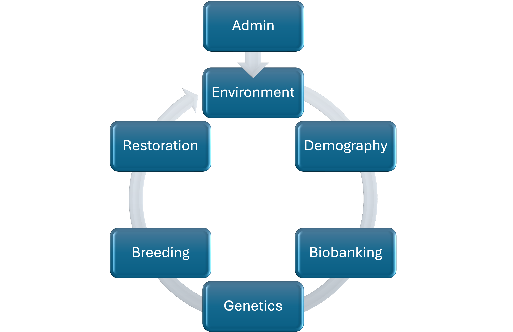

# LEPA Fieldwork Protocol & Seed Collection Database — Documentation

**Project:** Genetic Rescue of Threatened Plants
**Species:** *Lepidium papilliferum* (slickspot peppergrass, LEPA)
**Institution:** Boise State University
**Date:** April 2026

---

## Contact

**Sven BUERKI, Ph.D.**
Department of Biological Sciences, Boise State University
svenbuerki@boisestate.edu

---

## Introduction

This document provides documentation on the data life cycle, database structure, and field protocols underpinning the LEPA genetic rescue program. For preliminary results from the 2025 fieldwork season, see the full project report.

---

## Aim

The overarching aim of this project is to develop a transferable framework for the **genetic rescue** of threatened plant species, using slickspot peppergrass (*Lepidium papilliferum*; LEPA) — a federally threatened species endemic to southwestern Idaho's sagebrush-steppe ecosystem — as the focal implementation.

---

## Problem

Threatened species are often caught in an **extinction vortex**, where small population sizes and genetic erosion reduce their adaptability to environmental and anthropogenic threats. This process accelerates population declines, leading to local extirpations and ultimately species extinction.

---

## Solution

> Implement **informed breeding** strategies to restore **functionally viable** and **genetically diverse** soil seed banks, thereby enhancing population resilience and long-term sustainability.

This solution is implemented within a **relational database** to support deployment and scalability across species and programs.

---

## Approach

### Genetic Rescue Process

The following six steps outline the research and development activities required to conduct a successful genetic rescue. These steps were co-designed with federal partners.

1. **Determine population genetic diversity** and **define seed zones** for translocation.
   *Assess genetic variation across populations to identify suitable sources and guide translocation planning.*
2. **Conduct fieldwork** and **develop seed biobanking protocols**.
   *Collect representative samples and establish standardized methods for seed handling, storage, and documentation.*
3. **Characterize seed behavior** and **germination requirements**.
   *Evaluate dormancy types, environmental cues, and physiological traits influencing germination success.*
4. **Conduct seed bulking** for propagation.
   *Increase the quantity of genetically diverse seeds under controlled conditions for research and restoration use.*
5. **Implement informed breeding** to restore genetic diversity and seed dormancy.
   *Use controlled crosses and genetic data to enhance adaptive traits and maintain population variability.*
6. **Carry out seed reintroductions** to restore and sustain populations.
   *Reestablish self-sustaining populations in suitable habitats using genetically and ecologically informed strategies.*

### Propagation vs. Breeding

| Aspect | Propagation | Breeding |
|--------|-------------|----------|
| **Goal** | Increase the number of individuals from existing genetic material | Modify or enhance genetic traits through controlled mating |
| **Genetic focus** | Maintain or represent existing diversity | Change or optimize genetic composition intentionally |
| **Typical methods** | Germinating seeds, vegetative cuttings, tissue culture | Controlled cross-pollination, hybridization, phenotype/genotype selection |
| **Outcome** | More plants or seeds for translocation or reintroduction | New or improved genotypes for restoration or resilience |
| **Example** | Growing hundreds of individuals from wild seeds to reestablish a population | Crossing individuals from different populations to restore seed dormancy |

---

## Data Life Cycle

The data flow is organized into **seven modules** (see figure below) that, when integrated, support informed breeding programs generating seeds for ecological restoration of threatened plants. The data flow is designed to reverse the species extinction vortex by increasing population adaptability, individual survival and reproduction, and population growth.



### Database Modules and Tables {#datastr}

#### Admin

Stores project-level metadata supporting the genetic rescue process.

| Table | Description |
|-------|-------------|
| `Persons` | Personnel involved in the genetic rescue process |
| `Projects` | Funded grants underpinning each step of the genetic rescue process |
| `Studies` | Studies (e.g., grant objectives, dissertation chapters) supporting the projects |
| `Experiments` | Scientific experiments based on hypotheses; results tested in `Trials` |
| `Protocols` | Protocols used to conduct experiments |
| `Multimedia` | Digital media (primarily JPEG images) linked to `locationID` and `occurrenceID` |
| `Notes` | Remarks on data quality (e.g., missing barcodes, missing coordinates) |
| `Trials` | Breeding trials to produce seeds for restoration, based on evidence from `Experiments` |

#### Environment

Stores data on the target organism, its geographic distribution, and threats.

| Table | Description |
|-------|-------------|
| `Taxonomy` | Taxonomy of the target organism |
| `Locations` | Geographic locations (EOs or sub-EOs) where occurrences take place; includes landscape condition data |
| `EOs` | Element Occurrence records (federally designated population units) |
| `EORankings` | EO ranking data from EO size, condition, landscape, and overall rank |

#### Demography

Stores data on population size, effective population size, and predicted recruitment at the population level.

| Table | Description |
|-------|-------------|
| `Events` | Discrete sampling units within a location (e.g., slickspots); records population size and habitat condition |
| `EODemography` | EO-level demographic data derived from `Events` |

#### Biobanking

Manages physical samples (seed accessions, DNA extractions) underpinning the genetic rescue process.

| Table | Description |
|-------|-------------|
| `Occurrences` | Individual organisms observed during an event; each assigned a unique `occurrenceID` |
| `Germplasm` | Seed accessions (`germplasmID`) collected from occurrences; includes estimated seed quantities |
| `GermplasmTransactions` | Records of seeds taken for experiments or trials; used to track accession balances |
| `SeedLots` | Mixed seed accessions combining multiple `occurrenceID`s into a single entry |
| `MolecularBank` | DNA/RNA/protein extractions and quality metrics from tissues or seed accessions (currently DNA-only; MP and Omega kits) |
| `TissueBank` | Tissue samples (leaf biomass) from occurrences used for genetic analysis; one occurrence may have multiple tissue tubes |
| `TissueTransactions` | Tissue-weight transactions (biomass drawn for extractions); mirrors `GermplasmTransactions` to reconstruct each tissue's remaining balance |
| `PedigreeNodes` | Pedigree data for each `occurrenceID`, supporting breeding strategy design |

#### Genetics

Manages sequencing and the genotyping pipeline for population and functional genetic analyses.

| Table | Description |
|-------|-------------|
| `Sequencing` | Sequencing metadata and data quality metrics (Oxford Nanopore; flow cell, barcode, library, plate, ingroup/outgroup) |
| `GenotypingStatus` | Per-occurrence status in the genotyping pipeline (DNA extraction → PCR/library prep → sequencing), with the action needed, pass/fail per round, and a derived next step to completion; an occurrence may have multiple entries |

#### Breeding

Captures the design and outcomes of breeding trials aimed at producing seeds for restoration.

| Table | Description |
|-------|-------------|
| `Crosses` | Hand-pollination records between two `occurrenceID`s in a controlled environment |

#### Restoration

Captures the design and outcomes of restoration trials. First trials are scheduled for 2027. No tables have been created yet.

---

### Additional Notes on `Occurrences`

The `provenance` field indicates the origin of each occurrence:

- **in situ** — individual found in the field
- **ex situ** — individual from a greenhouse of known wild origin
- **in vitro** — line cultured in vitro

This is particularly relevant to the `Crosses` table in the **Breeding** module.

---

### Additional Notes on `Germplasm` — Seed Count Estimation Model

A linear model estimates the number of seeds in a germplasm accession (`germplasmID`) based on seed lot weight (in grams). This model was developed by Teo.

**Equations:**

| Estimate | Formula |
|----------|---------|
| Point estimate | `(obs_weight − 0.0003681555) / 0.0004252451` |
| Lower bound (−95% PI) | `(obs_weight − 0.01926434 − 0.0003681555) / 0.0004252451` |
| Upper bound (+95% PI) | `(obs_weight + 0.01926434 − 0.0003681555) / 0.0004252451` |

**SQL implementation:**

```sql
-- Point estimate
UPDATE Germplasm
SET germplasmQuantityEstimate = ROUND((germplasmWeight - 0.0003681555) / 0.0004252451, 2);

-- Lower bound (−95% PI)
UPDATE Germplasm
SET germplasmQuantityEstimateLow = ROUND((germplasmWeight - 0.01926434 - 0.0003681555) / 0.0004252451, 2);

-- Upper bound (+95% PI)
UPDATE Germplasm
SET germplasmQuantityEstimateUpr = ROUND((germplasmWeight + 0.01926434 - 0.0003681555) / 0.0004252451, 2);
```

See `Protocols/1000_Seed_Weight.zip` for the underlying R script and calibration data.

---

### Additional Notes on `TissueTransactions` — a tissue-weight ledger

`TissueTransactions` tracks biomass drawn from tissue tubes so the remaining balance of each `tissueID` can be reconstructed — the tissue-side analogue of `GermplasmTransactions`. The model is a simple ledger:

- **Opening balance:** `TissueBank.tissueWeight` = the tube's starting weight.
- **Each withdrawal (one row):** `tissueWeightTaken` (the amount drawn, the debit) and `tissueWeightUpdated` (the weight remaining afterwards), with `personID`, `experimentID`, and `date`.
- **Current balance** = the latest `tissueWeightUpdated`, or `start weight − Σ tissueWeightTaken`.

> ⚠️ **Provenance & current scope.** This table was **created on 2026-07-02 and was not part of the original tissue-bank files.** It is seeded **log-only** (like `GermplasmTransactions`) from the tissue bank's `current_weight` column, for the **33** tubes whose current weight differs from their start weight. It is therefore a **single reconciling snapshot per tube, not a full per-withdrawal history** — individual draws cannot be separated, and `personID` / `experimentID` / `date` are **empty because the source recorded only a current weight**, not who drew tissue, when, or why. Five tubes carry an impossible **negative remaining weight** (scale/tare artifacts, flagged for the lab team). **Going forward, log each withdrawal as its own row** (amount taken, person, experiment, date) to make this a true balance ledger.

---

## Field Data Collection

Data creation is linked to fieldwork and follows the protocol below (see figure). This protocol drives the design of data-entry forms.


**Step-by-step protocol:**

1. Travel to a defined `locationID` (recorded in `Locations`). Assign a unique `locationID` and photograph the site (metadata stored in `Multimedia`).
2. Identify specific events within the location (recorded in `Events`). Assign a unique `eventID` and record population size and condition variables.
3. Record metadata on individual plants providing seeds (recorded in `Occurrences`). Assign a unique `occurrenceID` and photograph each plant.
4. Harvest seeds from occurrences and store in individual labeled envelopes.
5. In the BSU lab, clean and weigh the seeds from each envelope. Assign a unique `germplasmID` and store accessions at 4°C.

**Field data entry forms** are available in `Protocols/`:

- `01_Location_LEPA fieldwork 2025_PM.docx` — Location / Element Occurrence form
- `02_Event_LEPA fieldwork 2025_PM.docx` — Slick spot & individual plant form

---

## Spatial Hierarchy

Every record is anchored to a four-level spatial hierarchy:

```
EO (Element Occurrence — federally designated population)
 └── Location (discrete site within an EO)
      └── Event (individual slick spot within a Location)
           └── Occurrence (individual fruiting plant)
                └── Germplasm (seed accession from that plant)
```

---

## Terminology and Data Standards

All field names follow international biodiversity and germplasm standards. Custom terms are defined in the `Terms` table (54 entries).

| Standard | Scope | Reference |
|----------|-------|-----------|
| Darwin Core | Occurrence and location data | https://dwc.tdwg.org/terms/ |
| Dublin Core | Metadata | https://www.dublincore.org/specifications/dublin-core/ |
| PlantBreeding / BrAPI v2.1 | Germplasm and breeding data | https://github.com/plantbreeding/BrAPI |
| BBMRI-ERIC / MIABIS | Biobank and sample data | https://github.com/BBMRI-ERIC/miabis |

---

## Database

### Technology

- **Engine:** SQLite 3 (no separate server process required)
- **Filename:** `LEPA_SQL.db`
- **Tables:** 28 (plus two system tables: `TableModules`, `Terms`)

### Key Relationships

```
Taxonomy    (1) ──< Locations    (many)
Locations   (1) ──< Events       (many)
Events      (1) ──< Occurrences  (many)
Occurrences (1) ──< Germplasm    (many)
Germplasm   (many) >──< Crosses  (many, via crossID)
```

### Schema Metadata

- `TableModules` — links each table to its module (see Data Life Cycle figure above)
- `Terms` — definitions and standard references for every field name in the database

### Data Sensitivity

*Lepidium papilliferum* is listed as threatened under the Endangered Species Act (ESA). Per U.S. Fish and Wildlife Service guidelines, precise GPS coordinates **must not be made public**. The following fields must be excluded from any public-facing interface:

- `locationDecimalLatitude`, `locationDecimalLongitude`
- `eventDecimalLatitude`, `eventDecimalLongitude`

**Data owner:** Buerki Lab, Department of Biological Sciences, Boise State University.
Contact svenbuerki@boisestate.edu before redistributing any subset of this database.

---

## Key Publications

- Buerki et al. (2019) *Bioinformatics* — https://doi.org/10.1093/bioinformatics/btz190
- Buerki et al. (2022) *G3: Genes, Genomes, Genetics* — https://doi.org/10.1093/g3journal/jkac078
