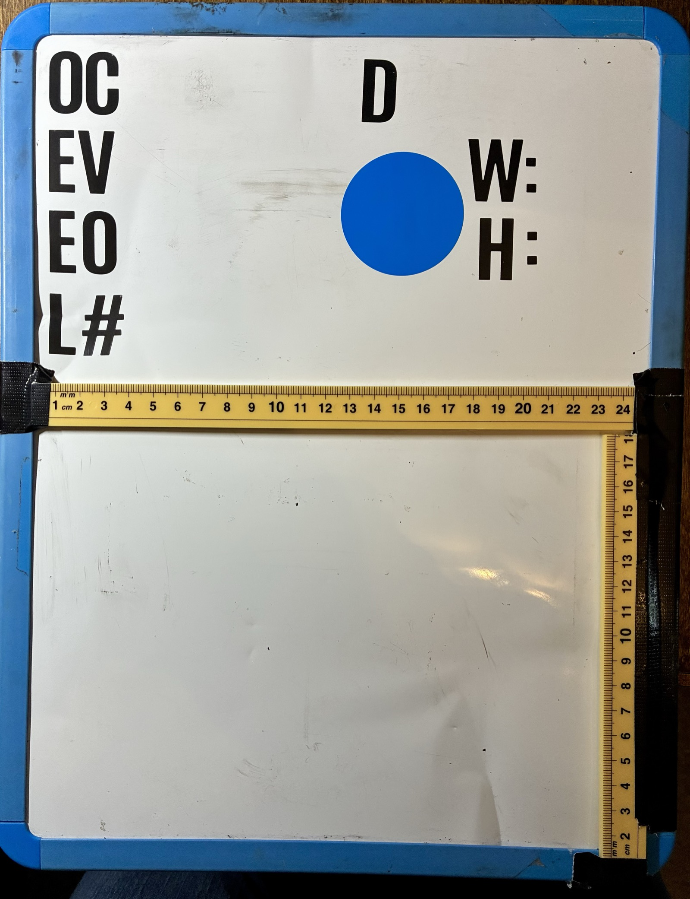
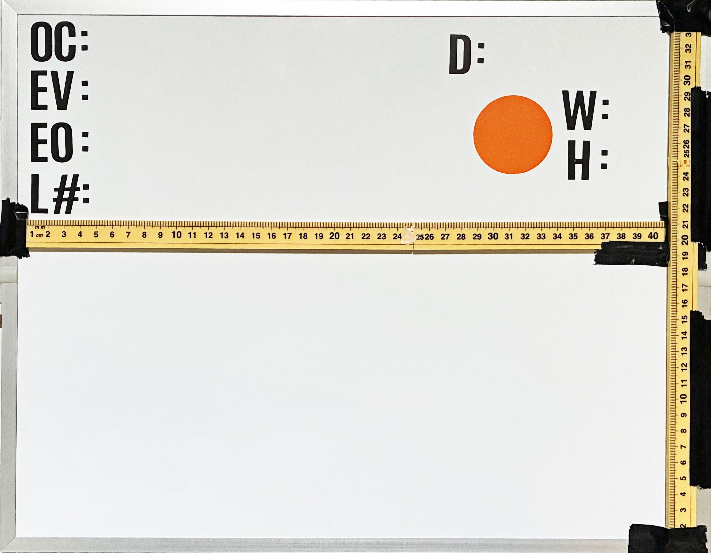

# LEPA Fieldwork Protocol & Seed Collection Database

**Species:** *Lepidium papilliferum* (slickspot peppergrass, LEPA)
**Status:** Federally threatened (Endangered Species Act)
**Institution:** Boise State University — Buerki Lab
**Contact:** Sven BUERKI, Ph.D. — svenbuerki@boisestate.edu

---

## Overview

This repository supports a **genetic rescue program** for slickspot peppergrass (*Lepidium papilliferum*), a federally threatened plant endemic to southwestern Idaho's sagebrush-steppe ecosystem.

The core goal is to develop a transferable framework for genetic rescue of threatened plants: restoring functionally viable and genetically diverse seed banks across a species' range through informed breeding and targeted reintroduction. The program is implemented in a spatially-oriented SQLite database that tracks individual plants from field collection through biobanking, breeding trials, and restoration.

The six-step genetic rescue pipeline:

1. Determine genetic diversity across the landscape
2. Conduct targeted fieldwork and seed collection
3. Characterize seeds (weight → estimated seed count)
4. Build bulked seed lots for restoration
5. Execute controlled breeding trials to increase diversity
6. Reintroduce material to under-represented populations

---

## Author

**Sven Buerki, Ph.D.** (he/him)\
Associate Professor\
Dr. Christopher Davidson Endowed Chair in Botany\
Department of Biological Sciences\
Boise State University\
Boise, Idaho, USA

📧 [svenbuerki@boisestate.edu](mailto:svenbuerki@boisestate.edu)

**Co-authors:** Peggy Martinez, Mathew Geisler, Sam Billingsley, Isaac Carretero, Jim Beck & Ian Robertson\
Department of Biological Sciences, Boise State University

---

## Repository Structure

```
SQL_DB/
├── LEPA_SQL.db                          # Core SQLite3 database
├── README.md                            # This file
├── Multimedia_images/<year>/<date>/     # RAW field images (immutable source; one folder per field day)
├── Multimedia_main/                     # Renamed unique-name copies (LEPA_<date>_<sha8>.jpg) + file_registry.csv
├── Field_forms/<year>/                  # photographed field sheets (Location + Event forms) — Stage A input
├── Multimedia_pipeline/                 # field-form + image → database pipeline
│   ├── IMAGE_PIPELINE_GUIDE.md          # ▶ how the pipeline works, both stages (start here)
│   ├── DATA_QUALITY.md                  # ▶ data-quality status + tracked issues
│   ├── field_forms_ocr.py              # Stage A: forms → Locations/Events/Occurrences (+ form images)
│   ├── 00_sort_by_date.py … 03_phenotype.py, stageB_load.py   # Stage B: plant images → Multimedia + Phenotyping
│   ├── PIPELINE_LOG.md                  # running log of every --apply
│   ├── REPORT_2025_measurement.md, REPORT_2026_pipeline_dryrun.md, ISSUE_filename_collision.md
│   └── legacy_2025/                     # archived 2025 pipeline scripts
├── Documentation/
│   ├── LEPA_DB_Documentation.md        # Database & protocol documentation (GitHub-facing)
│   ├── Documentation_LEPA_fieldwork.Rmd # Full project report source (R/bookdown)
│   ├── Documentation_LEPA_fieldwork.html
│   └── Figures/                         # Maps, diagrams, workflow figures
├── Protocols/
│   ├── 01_Location_LEPA fieldwork 2025_PM.docx  # Location/EO data-entry form
│   ├── 02_Event_LEPA fieldwork 2025_PM.docx     # Slick spot & plant data-entry form
│   └── 1000_Seed_Weight.zip             # R script + calibration data for seed-weight model
├── Queries/                             # Analysis scripts + pre-computed query results
└── Not_GitHub/                          # Local development files (not versioned)
```

**Full database and protocol documentation:** [`Documentation/Documentation_DB.md`](Documentation/Documentation_DB.md)

---

## Database

- **Engine:** SQLite 3
- **File:** `LEPA_SQL.db`
- **Tables:** 22 (plus two system tables: `TableModules`, `Terms`)

The database is organized into seven modules:

| Module | Purpose |
|--------|---------|
| **Admin** | Staff, project metadata, QC notes, multimedia |
| **Environment** | Spatial hierarchy, taxonomy, EO rankings |
| **Demography** | Population size and habitat condition per event/EO |
| **Biobanking** | Seed accessions, transactions, tissue and molecular samples |
| **Genetics** | Sequencing metadata and quality metrics |
| **Breeding** | Hand-pollination records and trial design |
| **Restoration** | Restoration trial outcomes (planned for 2027) |

### Spatial Hierarchy

```
EO (Element Occurrence — federally designated population)
 └── Location (discrete site within an EO)
      └── Event (individual slick spot)
           └── Occurrence (individual fruiting plant)
                └── Germplasm (seed accession from that plant)
```

### Field campaigns at a glance (2025 vs 2026-so-far)

| Metric | 2025 | 2026 (so far) |
|---|---|---|
| **EOs sampled** | 19 | 8 |
| **Locations** | 39 | 8 (7 revisits + 1 new site, EO69) |
| **Events** (slick spots) | 237 | 64 |
| **Occurrences** (fruiting plants) | 810 | 234 |
| &nbsp;&nbsp;in situ (field) / ex situ (greenhouse) | 765 / 45 | 234 / 0 |
| **Phenotyped** (of in-situ field plants) | 741 / 765 (**97%**) | 223 / 234 (**95%**) |
| &nbsp;&nbsp;size class — small / medium / large | 387 / 241 / 113 | 70 / 103 / 50 |
| &nbsp;&nbsp;median height; crown width | 9 cm; 9 cm | 14 cm; 13 cm |

*2026 EOs: EO18, EO38, EO52, EO68, EO69, EO70, EO76, EO118. The 2025 occurrences are a mix of **765 in-situ
field plants** (photographed with boards → phenotyped) and **45 ex-situ greenhouse-grown accessions**
(not field-photographed; imaged later by design). 2025 also produced 785 germplasm accessions
(~476,140 estimated seeds) and 43 hand-pollination crosses; 2026 biobanking is in progress.*

**Take-home from the phenotyping (964 plants measured from field photos):**

1. **The image measurement is validated.** On the **121 plants** whose boards carried a field-written
   height/width, the photo estimate matched the hand tape to a **median of ±1 cm**. The low-cost photo
   method reproduces tape measurements — with **size class as the robust primary metric and cm as
   supporting**.
2. **Coverage of field plants is high** — **97%** of 2025 *in-situ* plants (741/765) and **95%** of
   2026's (223/234) were phenotyped, from the *same* photos that link each occurrence (one image →
   link + trait). The **45 ex-situ greenhouse accessions** (2025) carry no field board photo and are
   imaged later by design ([#3](https://github.com/svenbuerki/Genetic-Rescue-DB/issues/3)).
3. **2025 skewed small** (52% small; median 9 cm); **2026-so-far skews larger** (median 14 cm; more
   medium/large). This is **preliminary** — 2026 covers only 8 EOs / 234 plants and may reflect which
   sites and dates have been processed rather than a real size shift.

---

## Image → Database Pipeline (field photo to record)

Every fruiting plant is photographed in the field with a whiteboard (ID + date + rulers).
Those photos feed **Multimedia**, **Phenotyping**, and (from 2026) **Occurrences** themselves.

**From 2026 the pipeline runs in two stages (forms first):**
**Stage A — field forms → records** (`field_forms_ocr.py`): OCR the paper Location/Event sheets to
create the `Locations`, `Events`, and `Occurrences` (with GPS), and file each form image into
`Multimedia` as evidence. **Stage B — plant images → multimedia + phenotyping** (the four scripts
below + `stageB_load.py`): link each whiteboard photo to its occurrence by board number and measure
the plant. (In 2025 the flow was the reverse — link photos to already-digitized occurrences.)

> 📖 **Full pipeline guide:** [`Multimedia_pipeline/IMAGE_PIPELINE_GUIDE.md`](Multimedia_pipeline/IMAGE_PIPELINE_GUIDE.md) (both stages, folder convention, naming, idempotency, override files). &nbsp; 🩺 **Data-quality status:** [`Multimedia_pipeline/DATA_QUALITY.md`](Multimedia_pipeline/DATA_QUALITY.md). &nbsp; 📊 **2026 campaign results:** [`Multimedia_pipeline/REPORT_2026_campaign.md`](Multimedia_pipeline/REPORT_2026_campaign.md).

### Two operating modes

| | **2025 mode — link & verify** | **2026 mode — pre-populate** |
|---|---|---|
| Records exist first? | Yes — field sheets hand-digitized into `Occurrences` | **No** — the image creates the record |
| Board read is… | **cross-checked** against the existing occurrence | the **source of truth** (no field-sheet to check against) |
| Validation comes from | matching the board number to a known row | **on-board redundancy + OCR ensemble + human gate** |
| Risk | low (two independent sources) | higher → mitigated by staging + review |

2026 mode removes the cross-check, so trust is rebuilt with **board structure** (printed
`O=`/`EO=`/`L=` fields), **independent on-board `h=`/`w=` measurements**, and a **mandatory
human review gate** — no record is written until a person approves the staged batch.

### The adapted 2026 board (what every field photo should carry)

The board comes in **two sizes**, chosen to fit the plant and identified by **sticker colour**. Both
carry the **same printed labels** — only the ruler range differs, so an image is read the same way
whichever board was used.

| | **Standard board** | **Large board** |
|---|---|---|
| Sticker colour | blue | orange |
| Rulers (x · y) | 1–24 cm · 1–~18 cm | 1–40 cm · 1–~33 cm |
| Use for | small–medium plants | large plants |

| Standard (blue) | Large (orange) |
|---|---|
|  |  |

Each printed label maps to one database field:

| Board label | Database field | Notes |
|---|---|---|
| **OC** | `occurrenceID` | the unique plant barcode — one number per plant, never reused |
| **EV** | `eventID` | the sampling event (slick spot) |
| **EO** | `EOCode` | Element Occurrence code |
| **L#** | `locationID` | the site — **resolves to GPS** |
| **D** | `eventDate` | |
| **W:** | `occurrenceCrownSize` (cm) | crown width, read against the rulers |
| **H:** | `occurrenceHeight` (cm) | plant height, read against the rulers |
| colour **sticker** | board size | encodes which board: **blue = standard**, **orange = large** |
| two **rulers** | scale | `x` and `y` axes for image measurement — **read the board's own graduations** (to 24 cm on the standard board, to 40 cm on the large board) |

`W`/`H` are written in the field and double as a **ground-truth check** on the image-measured values
(2026 validation: ±1 cm). A coordinate — or an `L#` that resolves to one — **must** accompany each
board: a `Location` is *defined* by its GPS, so without it no Occurrence can be created.

### Storage & collision-proof naming

Raw images live **only** in `Multimedia_images/<year>/<YYYY-MM-DD>/` (one folder per field day).
The pipeline copies each into a flat `Multimedia_main/` under a unique, content-addressed name
**`LEPA_<date>_<sha8>.jpg`**. This exists because camera filenames (`JCN_####`) reset every season
and once silently overwrote 56 of the 2025 images — content-addressing makes that impossible. The
original camera name, year, field-day date, EXIF capture time and SHA-256 are kept as provenance
(new `Multimedia` columns + `Multimedia_main/file_registry.csv`).

### The pipeline — four scripts (mapping to steps A → E)

| Script | Step | Role |
|---|---|---|
| `00_sort_by_date.py` | — | sort loose year-folder images into date subfolders |
| `01_ingest_register.py` | **A** | rename to `LEPA_<date>_<sha8>.jpg` → `Multimedia_main/`; update `Multimedia` identifier + provenance |
| `02_ocr.py` | **B/C** | worklist of un-linked images → OCR sweep → **review staging** (`NEW_EO`/`NEEDS_LOCATION` flags; nothing auto-created) |
| `03_phenotype.py` | **E** | worklist of unmeasured occurrences → measurement sweep → insert `Phenotyping` |

Each is **dry-run by default**, **backs up the DB** before any write, and logs to
[`Multimedia_pipeline/PIPELINE_LOG.md`](Multimedia_pipeline/PIPELINE_LOG.md). An **idempotency rule**
runs throughout: OCR only images not yet linked to an occurrence; phenotype only occurrences with no
measurement — so re-running never duplicates work. The OCR/measurement itself is an in-session
read-only agent sweep (subscription, no per-image API cost). Full details in the
[pipeline guide](Multimedia_pipeline/IMAGE_PIPELINE_GUIDE.md).

### How well does it work? (2026 blind dry-run, 128 boards)

A blind dry-run against records we already trust (full write-up:
[`Multimedia_pipeline/REPORT_2026_pipeline_dryrun.md`](Multimedia_pipeline/REPORT_2026_pipeline_dryrun.md)):

- **OCR:** occurrence ID **96%**, EO code reproduced the database except where the *database*
  was wrong — the blind read **caught a real mis-linkage** (5 plants stored under the wrong EO,
  since corrected).
- **Measurement repeatability:** median **±2 cm** (height & crown); **size class ~81%**.
- **Guidance:** **size class is the primary size metric; cm is supporting.** A taller in-frame
  scale is the highest-value field-kit fix.

**Current state (2026-06-30):** the pipeline is migrated and live, and the **2026 campaign is loaded
through EO18-7** — Occurrences **1044**, Events **301**, Phenotyping **964**, Multimedia **1175** (incl.
136 field-form images). Event numbers are **barcode-verified** (CODE128 decode caught + fixed 5
mis-entries); the 2026 field h/w validated the image phenotyping to **~±1 cm** across 121 boards. See
[`DATA_QUALITY.md`](Multimedia_pipeline/DATA_QUALITY.md) for standing items + tracked issues and
[`REPORT_2026_campaign.md`](Multimedia_pipeline/REPORT_2026_campaign.md) for the campaign write-up.

> **For the field team:** structured board fields + GPS + on-board `h/w` + unique, never-reused
> occurrence numbers are what make automated pre-population safe. Everything still passes a human
> review gate before it enters the database.

---

## Data Sensitivity

*Lepidium papilliferum* is listed as threatened under the ESA. Per U.S. Fish and Wildlife Service guidelines, **precise GPS coordinates must not be made public**. The following fields must be excluded from any public-facing interface:

`locationDecimalLatitude`, `locationDecimalLongitude`, `eventDecimalLatitude`, `eventDecimalLongitude`

---

## Terminology and Standards

| Standard | Scope |
|----------|-------|
| [Darwin Core](https://dwc.tdwg.org/terms/) | Occurrence and location data |
| [Dublin Core](https://www.dublincore.org/specifications/dublin-core/) | Metadata |
| [PlantBreeding / BrAPI v2.1](https://github.com/plantbreeding/BrAPI) | Germplasm and breeding data |
| [BBMRI-ERIC / MIABIS](https://github.com/BBMRI-ERIC/miabis) | Biobank and sample data |

Custom terms are defined in the `Terms` table (54 entries).

---

## Key Publications

- Selby P, et al. (2019) BrAPI—an application programming interface for plant breeding applications. *Bioinformatics* 35(20):4147–4155. https://doi.org/10.1093/bioinformatics/btz190
- Morales N, et al. (2022) Breedbase: a digital ecosystem for modern plant breeding. *G3: Genes|Genomes|Genetics* 12(7):jkac078. https://doi.org/10.1093/g3journal/jkac078

---

## Data Ownership

Buerki Lab, Department of Biological Sciences, Boise State University.
Contact svenbuerki@boisestate.edu before redistributing any subset of this database.
